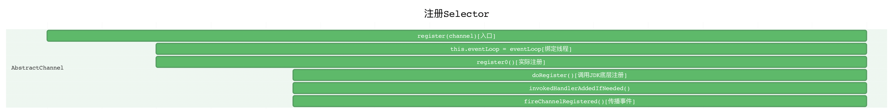

# Netty源码分析（一）：ServerBootstrap启动流程

## 1. ServerBootstrap启动代码

```java
ServerBootstrap b = new ServerBootstrap();
b.group(bossGroup, workerGroup)
        .channel(NioServerSocketChannel.class) //为启动类赋值一个ChannelFactory
        .childOption(ChannelOption.TCP_NODELAY, true)
        .childAttr(AttributeKey.newInstance("childAttr"), "childAttrValue")
        .handler(new ServerHandler())
        .childHandler(new ChannelInitializer<SocketChannel>() {
            @Override
            public void initChannel(SocketChannel ch) {
                ch.pipeline().addLast(new AuthHandler());
                //..

            }
        });

ChannelFuture f = b.bind(8888).sync();

f.channel().closeFuture().sync();
```

## 2. 两个问题

1. 服务端的Socket在哪里初始化？
2. 在哪里Accept连接？

## 3. 服务端启动主要过程

1. 创建服务端的Channel
2. 初始化服务端的Channel
3. 注册Selector
4. 端口绑定

### 3.1. 创建服务端的Channel

#### 3.1.1. 创建NioServerSocketChannel

服务端创建`NioServerSocketChannel`的流程大致如下：


首先看`bind()`方法，一步一步点下去：

```java
public ChannelFuture bind(int inetPort) {
    return this.bind(new InetSocketAddress(inetPort));
}
```

```java
public ChannelFuture bind(SocketAddress localAddress) {
    this.validate();
    if (localAddress == null) {
        throw new NullPointerException("localAddress");
    } else {
        return this.doBind(localAddress);
    }
}
```

```java
private ChannelFuture doBind(final SocketAddress localAddress) {
    final ChannelFuture regFuture = this.initAndRegister();
    final Channel channel = regFuture.channel();
    if (regFuture.cause() != null) {
        return regFuture;
    } else if (regFuture.isDone()) {
        ChannelPromise promise = channel.newPromise();
        doBind0(regFuture, channel, localAddress, promise);
        return promise;
    } else {
        final AbstractBootstrap.PendingRegistrationPromise promise = new AbstractBootstrap.PendingRegistrationPromise(channel);
        regFuture.addListener(new ChannelFutureListener() {
            public void operationComplete(ChannelFuture future) throws Exception {
                Throwable cause = future.cause();
                if (cause != null) {
                    promise.setFailure(cause);
                } else {
                    promise.registered();
                    AbstractBootstrap.doBind0(regFuture, channel, localAddress, promise);
                }

            }
        });
        return promise;
    }
}
```

这里出现了`initAndRegister()`方法，继续点进去：

```java
final ChannelFuture initAndRegister() {
    Channel channel = null;

    try {
        channel = this.channelFactory.newChannel();
        this.init(channel);
    } catch (Throwable var3) {
        if (channel != null) {
            channel.unsafe().closeForcibly();
        }

        return (new DefaultChannelPromise(channel, GlobalEventExecutor.INSTANCE)).setFailure(var3);
    }

    ChannelFuture regFuture = this.config().group().register(channel);
    if (regFuture.cause() != null) {
        if (channel.isRegistered()) {
            channel.close();
        } else {
            channel.unsafe().closeForcibly();
        }
    }

    return regFuture;
}
```

注意到`channel = this.channelFactory.newChannel();`，通过工厂来获取一个Channel，继续点击去查看`newChannel()`方法：

```java
public T newChannel() {
    try {
        return (Channel)this.clazz.newInstance();
    } catch (Throwable var2) {
        throw new ChannelException("Unable to create Channel from class " + this.clazz, var2);
    }
}
```

这里是通过反射来获取Channel实例的，那么这个`clazz`和`channelFactory`又是在哪里传进来的呢？这里需要我们回到`ServerBootstrap.channel()`，其代码如下：

```java
public B channel(Class<? extends C> channelClass) {
    if (channelClass == null) {
        throw new NullPointerException("channelClass");
    } else {
        return this.channelFactory((io.netty.channel.ChannelFactory)(new ReflectiveChannelFactory(channelClass)));
    }
}
```

其中`channelFactory()`只是将channelFactory进行赋值，并且返回`ServerBootstrap`本身。可以看到，该方法中将channelClass封装成了一个`ReflectiveChannelFactory`，这个channelClass就是我们传进来的`NioServerSocketChannel.class`。我们点进去`ReflectiveChannelFactory`查看一下它的构造函数：

```java
public ReflectiveChannelFactory(Class<? extends T> clazz) {
    if (clazz == null) {
        throw new NullPointerException("clazz");
    } else {
        this.clazz = clazz;
    }
}
```

到这里，就可以通过Factory来进行`NioServerSocketChannel`的获取。但是`NioServerSocketChannel`只是Netty对Java底层的Channel所做的一个封装，我们需要进一步点进去查看`NioServerSocketChannel`。

#### 3.1.2. NioServerSocketChannel的构造

这里主要是用`NioServerSocketChannel`来对JDK提供的Channel进行一个封装：


首先是`NioServerSccketChannel`的构造方法：

```java
public NioServerSocketChannel() {
    this(newSocket(DEFAULT_SELECTOR_PROVIDER));
}
```

点进去查看`newSocket`方法：

```java
private static java.nio.channels.ServerSocketChannel newSocket(SelectorProvider provider) {
    try {
        return provider.openServerSocketChannel();
    } catch (IOException var2) {
        throw new ChannelException("Failed to open a server socket.", var2);
    }
}
```

这里调用JDK底层的方法打开一个Channel。其中`DEFAULT_SELECTOR_PROVIDER`是通过`SelectorProvider.provider()`来进行创建的。至此，我们就获得了一个JDK底层真正的Channel了。

回到构造方法上，继续点进去：

```java
public NioServerSocketChannel(java.nio.channels.ServerSocketChannel channel) {
    super((Channel)null, channel, 16);
    this.config = new NioServerSocketChannel.NioServerSocketChannelConfig(this, this.javaChannel().socket());
}
```

分为两个部分： 1. 继续调用父类构造函数 2. 配置config。Config类中包含了TCP的各项配置信息，例如backlog等

继续点到父类查看对应的构造函数：

```java
protected AbstractNioMessageChannel(Channel parent, SelectableChannel ch, int readInterestOp) {
    super(parent, ch, readInterestOp);
}
```

继续：

```java
protected AbstractNioChannel(Channel parent, SelectableChannel ch, int readInterestOp) {
    super(parent);
    this.ch = ch;
    this.readInterestOp = readInterestOp;

    try {
        ch.configureBlocking(false);
    } catch (IOException var7) {
        try {
            ch.close();
        } catch (IOException var6) {
            if (logger.isWarnEnabled()) {
                logger.warn("Failed to close a partially initialized socket.", var6);
            }
        }

        throw new ChannelException("Failed to enter non-blocking mode.", var7);
    }
}
```

这里做了这几件事： 1. 调用父类构造函数 2. 为channel和readInterestOp进行赋值 3. 设置channel为非阻塞

我们继续查看父类的构造函数：

```java
protected AbstractChannel(Channel parent) {
    this.parent = parent;
    this.id = this.newId();
    this.unsafe = this.newUnsafe();
    this.pipeline = this.newChannelPipeline();
}
```

在这里进行了`id`、`unsafe`和`pipeline`的初始化。其中unsafe封装了一些底层的有关TCP读写相关的方法，pipeline在接下来会提到，是Netty中很重要的一个组件。

### 3.2. 初始化服务端的Channel

上面我们通过`initAndRegister()`方法中的`this.channelFactory.newChannel()`获得了一个Channel。现在我们需要对Channel进行初始化，初始化函数为`initAndRegister()`中的`this.init(channel);`。初始化过程主要分为以下几步：


点到`init()`方法内部进行查看：

```java
void init(Channel channel) throws Exception {
    // 设置Channel的Options和Attributes
    final Map<ChannelOption<?>, Object> options = options0();
    synchronized (options) {
        channel.config().setOptions(options);
    }

    final Map<AttributeKey<?>, Object> attrs = attrs0();
    synchronized (attrs) {
        for (Entry<AttributeKey<?>, Object> e: attrs.entrySet()) {
            @SuppressWarnings("unchecked")
            AttributeKey<Object> key = (AttributeKey<Object>) e.getKey();
            channel.attr(key).set(e.getValue());
        }
    }

    // 设置Child的Options和Attributes
    ChannelPipeline p = channel.pipeline();

    final EventLoopGroup currentChildGroup = childGroup;
    final ChannelHandler currentChildHandler = childHandler;
    final Entry<ChannelOption<?>, Object>[] currentChildOptions;
    final Entry<AttributeKey<?>, Object>[] currentChildAttrs;
    synchronized (childOptions) {
        currentChildOptions = childOptions.entrySet().toArray(newOptionArray(childOptions.size()));
    }
    synchronized (childAttrs) {
        currentChildAttrs = childAttrs.entrySet().toArray(newAttrArray(childAttrs.size()));
    }

    p.addLast(new ChannelInitializer<Channel>() {
        @Override
        public void initChannel(Channel ch) throws Exception {

            // 配置服务端pipeline
            final ChannelPipeline pipeline = ch.pipeline();
            ChannelHandler handler = config.handler();
            if (handler != null) {
                pipeline.addLast(handler);
            }


            // 添加连接器，通过线程池进行acceptor的addLast操作，是为了保证Acceptor始终在pipeline的最后一个。即最后一次执行的addLast中添加进去的。例如当Handler类型为ChannelInitializer（成为B）时，用户会在ChannelInitializer中继续添加很多其他的Handler，如果Acceptor的addLast执行在同一个线程中执行，会导致在Acceptor的添加后，initChannel才会返回，pipeline继续往下找到刚添加进去的ChannelInitializer（B），再添加ChannelInitializer（B）中的其他Handler。这就导致Acceptor不再pipeline的最后一位。

            // We add this handler via the EventLoop as the user may have used a ChannelInitializer as handler.
            // In this case the initChannel(...) method will only be called after this method returns. Because
            // of this we need to ensure we add our handler in a delayed fashion so all the users handler are
            // placed in front of the ServerBootstrapAcceptor.
            ch.eventLoop().execute(new Runnable() {
                @Override
                public void run() {
                    pipeline.addLast(new ServerBootstrapAcceptor(
                            currentChildGroup, currentChildHandler, currentChildOptions, currentChildAttrs));
                }
            });
        }
    });
}
```

首先，通过ServerBootstrap的`option()`和`attr()`将用户设置的option和Attribute传到`ServerBootstrap`的Map中存储，然后在初始化过程中，将Map的内容传到Config和Channel中：

```java
public <T> B option(ChannelOption<T> option, T value) {
    if (option == null) {
        throw new NullPointerException("option");
    }
    if (value == null) {
        synchronized (options) {
            options.remove(option);
        }
    } else {
        synchronized (options) {
            options.put(option, value);
        }
    }
    return (B) this;
}
```

```java
public <T> B attr(AttributeKey<T> key, T value) {
    if (key == null) {
        throw new NullPointerException("key");
    }
    if (value == null) {
        synchronized (attrs) {
            attrs.remove(key);
        }
    } else {
        synchronized (attrs) {
            attrs.put(key, value);
        }
    }
    return (B) this;
}
```

至此完成了`设置Channel的Options和Attributes`这一步。第二部`设置Child的Options和Attributes`与其类似。

接着，是`配置服务端pipeline`。handler通过`ServerBootstrap`的`handler()`方法传入。将handler通过`pipeline`的`addLast()`方法对其进行配置。

最后是`Acceptor`的添加。`Acceptor`是一个特殊的handler。通过`group()`,`childHandler()`,`childOption()`,`childAttr()`四个方法传进来的`currentChildGroup, currentChildHandler, currentChildOptions, currentChildAttrs`四个参数进行初始化。

### 3.3. 注册Selector



这一部分主要是`ServerBootstrap`将`EventLoopGroup`中的一个`EventLoop`和刚初始化的`channel`进行注册绑定的过程。 在`initAndRegister()`中，通过`config().group().register(channel)`进行注册操作。其中`group()`获取ServerBootstrap的group\(即通过用户指定传进来的EventLoopGroup\)，然后获取`EventLoopGroup`中的一个`EventLoop`，并调用它的`register(channel)`方法。再之后，获取到`channel`，调用`channel`的`unsafe`的`register`方法。最终的逻辑会到达`register(eventLoop,promise)`。以下是其具体代码：

```java
public final void register(EventLoop eventLoop, final ChannelPromise promise) {
    if (eventLoop == null) {
        throw new NullPointerException("eventLoop");
    }
    if (isRegistered()) {
        promise.setFailure(new IllegalStateException("registered to an event loop already"));
        return;
    }
    if (!isCompatible(eventLoop)) {
        promise.setFailure(
                new IllegalStateException("incompatible event loop type: " + eventLoop.getClass().getName()));
        return;
    }

    // 绑定线程，为Channel的eventLoop赋值
    AbstractChannel.this.eventLoop = eventLoop;

    // 实际注册
    if (eventLoop.inEventLoop()) {
        register0(promise);
    } else {
        try {
            eventLoop.execute(new Runnable() {
                @Override
                public void run() {
                    register0(promise);
                }
            });
        } catch (Throwable t) {
            logger.warn(
                    "Force-closing a channel whose registration task was not accepted by an event loop: {}",
                    AbstractChannel.this, t);
            closeForcibly();
            closeFuture.setClosed();
            safeSetFailure(promise, t);
        }
    }
}
```

首先是通过`this.eventLoop = eventLoop`绑定线程。之后通过`register0(promise)`进行注册。点击去查看代码：

```java
private void register0(ChannelPromise promise) {
    try {
        // check if the channel is still open as it could be closed in the mean time when the register
        // call was outside of the eventLoop
        if (!promise.setUncancellable() || !ensureOpen(promise)) {
            return;
        }
        boolean firstRegistration = neverRegistered;
        doRegister();
        neverRegistered = false;
        registered = true;

        // Ensure we call handlerAdded(...) before we actually notify the promise. This is needed as the
        // user may already fire events through the pipeline in the ChannelFutureListener.
        pipeline.invokeHandlerAddedIfNeeded();

        safeSetSuccess(promise);
        pipeline.fireChannelRegistered();
        // Only fire a channelActive if the channel has never been registered. This prevents firing
        // multiple channel actives if the channel is deregistered and re-registered.

        // 最开始注册只是绑定Selector，并未绑定端口，所以isActive()返回的是false
        if (isActive()) {
            if (firstRegistration) {
                pipeline.fireChannelActive();
            } else if (config().isAutoRead()) {
                // This channel was registered before and autoRead() is set. This means we need to begin read
                // again so that we process inbound data.
                //
                // See https://github.com/netty/netty/issues/4805
                beginRead();
            }
        }
    } catch (Throwable t) {
        // Close the channel directly to avoid FD leak.
        closeForcibly();
        closeFuture.setClosed();
        safeSetFailure(promise, t);
    }
}
```

继续点击`doRegister()`查看：

```java
protected void doRegister() throws Exception {
    boolean selected = false;
    for (;;) {
        try {
            selectionKey = javaChannel().register(eventLoop().selector, 0, this);
            return;
        } catch (CancelledKeyException e) {
            if (!selected) {
                // Force the Selector to select now as the "canceled" SelectionKey may still be
                // cached and not removed because no Select.select(..) operation was called yet.
                eventLoop().selectNow();
                selected = true;
            } else {
                // We forced a select operation on the selector before but the SelectionKey is still cached
                // for whatever reason. JDK bug ?
                throw e;
            }
        }
    }
}
```

首先，`JavaChannel()`获取之前初始化完成后的JDK底层的channel。之后调用它的注册方法，其中第一个参数是`Selector`，第二个`ops`是感兴趣的操作（0表示目前不对任何事件感兴趣），第三个`Attachment`参数是this，表示的是Netty中的Channel。当`Selector`轮询到事件发生时，可以通过`Attachment`得到Netty的Channel。

之后调用handler的`handlerAdded`和`channelRegistered`方法。

### 3.4. 服务端口的绑定


跟进`bind()`方法,一直到`tail.bind(localAddress, promise)`,继续点进去，有：

```java
public ChannelFuture bind(final SocketAddress localAddress, final ChannelPromise promise) {
    if (localAddress == null) {
        throw new NullPointerException("localAddress");
    }
    if (!validatePromise(promise, false)) {
        // cancelled
        return promise;
    }

    // 跟进findContextOutbound()方法，获得next = tail.prev。一直调用直到next为head，且head为HeadContext类。
    final AbstractChannelHandlerContext next = findContextOutbound();
    EventExecutor executor = next.executor();
    if (executor.inEventLoop()) {
        // 最终会调用HeadContext的invokeBind方法，跟进invokeBind，
        // 发现最后会继续调用HeadContext的bind()方法
        next.invokeBind(localAddress, promise);
    } else {
        safeExecute(executor, new Runnable() {
            @Override
            public void run() {
                next.invokeBind(localAddress, promise);
            }
        }, promise, null);
    }
    return promise;
}
```

继续查看`HeadContext`的`bind()`方法：

```java
public void bind(
    ChannelHandlerContext ctx, SocketAddress localAddress, ChannelPromise promise)
    throws Exception {
        unsafe.bind(localAddress, promise);
}
```

查看`unsafe.bind(localAddress, promise)`:

```java
public final void bind(final SocketAddress localAddress, final ChannelPromise promise) {
    assertEventLoop();

    if (!promise.setUncancellable() || !ensureOpen(promise)) {
        return;
    }

    // See: https://github.com/netty/netty/issues/576
    if (Boolean.TRUE.equals(config().getOption(ChannelOption.SO_BROADCAST)) &&
        localAddress instanceof InetSocketAddress &&
        !((InetSocketAddress) localAddress).getAddress().isAnyLocalAddress() &&
        !PlatformDependent.isWindows() && !PlatformDependent.isRoot()) {
        // Warn a user about the fact that a non-root user can't receive a
        // broadcast packet on *nix if the socket is bound on non-wildcard address.
        logger.warn(
                "A non-root user can't receive a broadcast packet if the socket " +
                "is not bound to a wildcard address; binding to a non-wildcard " +
                "address (" + localAddress + ") anyway as requested.");
    }

    // isActive(): return javaChannel().socket().isBound()
    // 还未绑定时是false
    boolean wasActive = isActive();
    try {
        // JDK底层绑定
        doBind(localAddress);
    } catch (Throwable t) {
        safeSetFailure(promise, t);
        closeIfClosed();
        return;
    }

    // 状态由非激活转到激活状态
    if (!wasActive && isActive()) {
        invokeLater(new Runnable() {
            @Override
            public void run() {
                // 传播active事件
                pipeline.fireChannelActive();
            }
        });
    }

    safeSetSuccess(promise);
}
```

其中核心方法是`doBind()`,点进去查看：

```java
protected void doBind(SocketAddress localAddress) throws Exception {
    if (PlatformDependent.javaVersion() >= 7) {
        javaChannel().bind(localAddress, config.getBacklog());
    } else {
        javaChannel().socket().bind(localAddress, config.getBacklog());
    }
}
```

这里通过调用JDK底层方法进行端口绑定。绑定成功后，会调用`pipeline.fireChannelActive()`进行active的事件传播：

```java
public final ChannelPipeline fireChannelActive() {
    AbstractChannelHandlerContext.invokeChannelActive(head);
    return this;
}
```

可以看到，该方法从`head`开始调用。`head`为`HeadContext`类。

```java
// 将事件向后传播，找到下一个ctx并且触发其invokeChannelActive()方法
public ChannelHandlerContext fireChannelActive() {
    final AbstractChannelHandlerContext next = findContextInbound();
    invokeChannelActive(next);
    return this;
}

// 执行对应ctx的invokeChannelActive()方法
static void invokeChannelActive(final AbstractChannelHandlerContext next) {
    EventExecutor executor = next.executor();
    if (executor.inEventLoop()) {
        next.invokeChannelActive();
    } else {
        executor.execute(new Runnable() {
            @Override
            public void run() {
                next.invokeChannelActive();
            }
        });
    }
}

private void invokeChannelActive() {
    // 是否调用ctx对应的handler的channelActive方法
    if (invokeHandler()) {
        try {
            // 在这里，会执行head的channelActive()方法
            ((ChannelInboundHandler) handler()).channelActive(this);
        } catch (Throwable t) {
            notifyHandlerException(t);
        }
    } else {
        // 传播active事件
        fireChannelActive();
    }
}
```

这里会执行HeadContext的`channelActive`方法。继续查看该方法：

```java
public void channelActive(ChannelHandlerContext ctx) throws Exception {
    // 传播active事件
    ctx.fireChannelActive();
    // 自身的处理逻辑
    readIfIsAutoRead();
}
```

查看`readIfIsAutoRead()`：

```java
private void readIfIsAutoRead() {
    if (channel.config().isAutoRead()) {
        channel.read();
    }
}
```

继续往下：

```java
public Channel read() {
    pipeline.read();
    return this;
}
```

继续：

```java
public final ChannelPipeline read() {
    tail.read();
    return this;
}
```

继续：

```java
public ChannelHandlerContext read() {
    final AbstractChannelHandlerContext next = findContextOutbound();
    EventExecutor executor = next.executor();
    if (executor.inEventLoop()) {
        next.invokeRead();
    } else {
        Runnable task = next.invokeReadTask;
        if (task == null) {
            next.invokeReadTask = task = new Runnable() {
                @Override
                public void run() {
                    next.invokeRead();
                }
            };
        }
        executor.execute(task);
    }

    return this;
}
```

该方法会传播`read`事件，一直传播到`head`节点，查看`head`的`read()`方法：

```java
public void read(ChannelHandlerContext ctx) {
    unsafe.beginRead();
}
```

最后还是需要调用`unsafe`的方法，继续查看：

```java
public final void beginRead() {
    assertEventLoop();

    if (!isActive()) {
        return;
    }

    try {
        doBeginRead();
    } catch (final Exception e) {
        invokeLater(new Runnable() {
            @Override
            public void run() {
                pipeline.fireExceptionCaught(e);
            }
        });
        close(voidPromise());
    }
}
```

这里继续查看`doBeginRead()`：

```java
protected void doBeginRead() throws Exception {
    // Channel.read() or ChannelHandlerContext.read() was called
    final SelectionKey selectionKey = this.selectionKey;
    if (!selectionKey.isValid()) {
        return;
    }

    readPending = true;

    // interestOps的值为0
    final int interestOps = selectionKey.interestOps();
    if ((interestOps & readInterestOp) == 0) {
        selectionKey.interestOps(interestOps | readInterestOp);
    }
}
```

在之前的`doRegister()`方法中，通过`selectionKey = javaChannel().register(eventLoop().selector, 0, this);`将channel注册了一个0的事件。因此`if`判断为`true`，执行`selectionKey.interestOps(interestOps | readInterestOp);`，将读兴趣事件`readInterestOp`写入到`selectionKey`。

在`NioServerSocketChannel`的构造函数中，通过`super((Channel)null, channel, 16);`传入的参数`16`，将`16`赋值给`Channel`的`readInterestOp`。`16`表示`SelectionKey.OP_ACCEPT`。

至此，就可以Accept连接了。

## 4. 总结

1. 调用`newChannel()`，通过反射创建一个服务端的`NioServerSocketChannel`，实际上就是调用JDK底层的API创建一个底层`channel`并且做了一个Netty的封装。为底层的`channel`加了几个组件：`pipeline`,`unsafe`和`id`等。
2. 调用`init()`方法，初始化`NioServerSocketChannel`。最核心的部分就是为`NioServerSocketChannel`增加一个`Acceptor`连接器，其实就是一个`Handler`。
3. 调用`register()`方法进行注册，将JDK底层的`channel`注册在`EventLoop`的`Selector`上。并且把Netty的服务端的`NioServerSocketChannel`作为`Attachment`绑定到JDK底层的`channel`上。
4. 调用`bind()`方法，调用JDK底层的API，来实现对本地端口的监听。同时重新向`Selector`注册一个`OP_ACCEPT`事件来接受新的连接。

