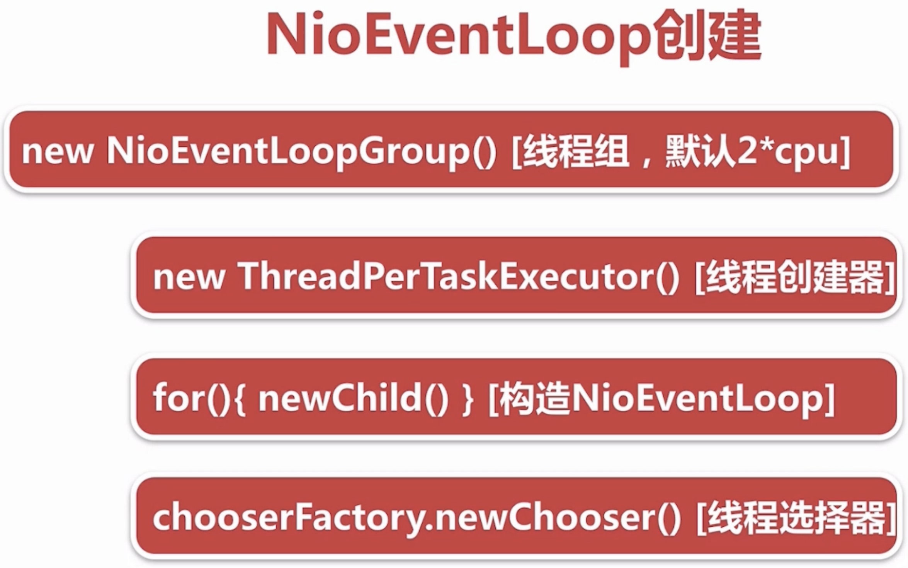
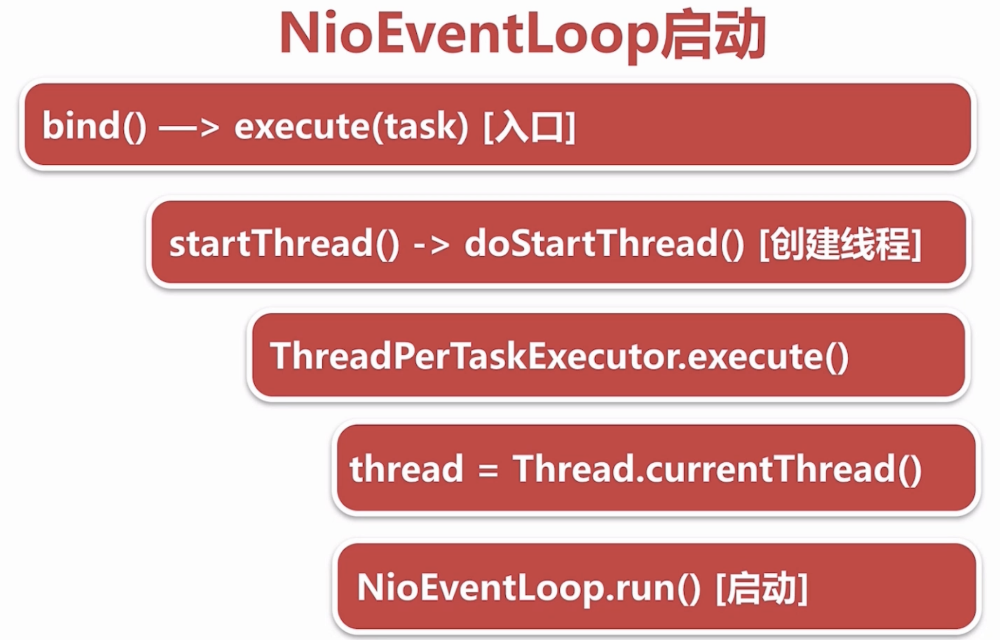

# Netty源码分析（二）：NioEventLoop的创建和启动

## 1. 相关代码

```java
/**
 * {@link MultithreadEventLoopGroup} implementations which is used for NIO {@link Selector} based {@link Channel}s.
 */
public class NioEventLoopGroup extends MultithreadEventLoopGroup {

    /**
     * Create a new instance using the default number of threads, the default {@link ThreadFactory} and
     * the {@link SelectorProvider} which is returned by {@link SelectorProvider#provider()}.
     */
    public NioEventLoopGroup() {
        this(0);
    }

    /**
     * Create a new instance using the specified number of threads, {@link ThreadFactory} and the
     * {@link SelectorProvider} which is returned by {@link SelectorProvider#provider()}.
     */
    public NioEventLoopGroup(int nThreads) {
        this(nThreads, (Executor) null);
    }

    /**
     * Create a new instance using the specified number of threads, the given {@link ThreadFactory} and the
     * {@link SelectorProvider} which is returned by {@link SelectorProvider#provider()}.
     */
    public NioEventLoopGroup(int nThreads, ThreadFactory threadFactory) {
        this(nThreads, threadFactory, SelectorProvider.provider());
    }

    public NioEventLoopGroup(int nThreads, Executor executor) {
        this(nThreads, executor, SelectorProvider.provider());
    }

    /**
     * Create a new instance using the specified number of threads, the given {@link ThreadFactory} and the given
     * {@link SelectorProvider}.
     */
    public NioEventLoopGroup(
            int nThreads, ThreadFactory threadFactory, final SelectorProvider selectorProvider) {
        this(nThreads, threadFactory, selectorProvider, DefaultSelectStrategyFactory.INSTANCE);
    }

    public NioEventLoopGroup(int nThreads, ThreadFactory threadFactory,
        final SelectorProvider selectorProvider, final SelectStrategyFactory selectStrategyFactory) {
        super(nThreads, threadFactory, selectorProvider, selectStrategyFactory, RejectedExecutionHandlers.reject());
    }

    public NioEventLoopGroup(
            int nThreads, Executor executor, final SelectorProvider selectorProvider) {
        this(nThreads, executor, selectorProvider, DefaultSelectStrategyFactory.INSTANCE);
    }

    public NioEventLoopGroup(int nThreads, Executor executor, final SelectorProvider selectorProvider,
                             final SelectStrategyFactory selectStrategyFactory) {
        super(nThreads, executor, selectorProvider, selectStrategyFactory, RejectedExecutionHandlers.reject());
    }

    public NioEventLoopGroup(int nThreads, Executor executor, EventExecutorChooserFactory chooserFactory,
                             final SelectorProvider selectorProvider,
                             final SelectStrategyFactory selectStrategyFactory) {
        super(nThreads, executor, chooserFactory, selectorProvider, selectStrategyFactory,
                RejectedExecutionHandlers.reject());
    }

    public NioEventLoopGroup(int nThreads, Executor executor, EventExecutorChooserFactory chooserFactory,
                             final SelectorProvider selectorProvider,
                             final SelectStrategyFactory selectStrategyFactory,
                             final RejectedExecutionHandler rejectedExecutionHandler) {
        super(nThreads, executor, chooserFactory, selectorProvider, selectStrategyFactory, rejectedExecutionHandler);
    }

    /**
     * Sets the percentage of the desired amount of time spent for I/O in the child event loops.  The default value is
     * {@code 50}, which means the event loop will try to spend the same amount of time for I/O as for non-I/O tasks.
     */
    public void setIoRatio(int ioRatio) {
        for (EventExecutor e: this) {
            ((NioEventLoop) e).setIoRatio(ioRatio);
        }
    }

    /**
     * Replaces the current {@link Selector}s of the child event loops with newly created {@link Selector}s to work
     * around the  infamous epoll 100% CPU bug.
     */
    public void rebuildSelectors() {
        for (EventExecutor e: this) {
            ((NioEventLoop) e).rebuildSelector();
        }
    }

    @Override
    protected EventLoop newChild(Executor executor, Object... args) throws Exception {
        return new NioEventLoop(this, executor, (SelectorProvider) args[0],
            ((SelectStrategyFactory) args[1]).newSelectStrategy(), (RejectedExecutionHandler) args[2]);
    }
}
```

## 2. 一个问题

1. 默认情况下，Netty服务端起多少线程？何时启动？

   \*\*\*\*

## **3. NioEventLoop的创建**



 根据构造函数一步一步往里看，最终会到达`MultithreadEventExecutorGroup()`：

```java
/**
* Create a new instance.
*
* @param nThreads          the number of threads that will be used by this instance.
* @param executor          the Executor to use, or {@code null} if the default should be used.
* @param chooserFactory    the {@link EventExecutorChooserFactory} to use.
* @param args              arguments which will passed to each {@link #newChild(Executor, Object...)} call
*/
protected MultithreadEventExecutorGroup(int nThreads, Executor executor,
                                     EventExecutorChooserFactory chooserFactory, Object... args) {
 if (nThreads <= 0) {
     throw new IllegalArgumentException(String.format("nThreads: %d (expected: > 0)", nThreads));
 }

 if (executor == null) {
     // 线程执行器
     executor = new ThreadPerTaskExecutor(newDefaultThreadFactory());
 }

 children = new EventExecutor[nThreads];

 // 构造NioEventLoopGroup的children
 for (int i = 0; i < nThreads; i ++) {
     boolean success = false;
     try {
         // 创建NioEventLoop
         children[i] = newChild(executor, args);
         success = true;
     } catch (Exception e) {
         // TODO: Think about if this is a good exception type
         throw new IllegalStateException("failed to create a child event loop", e);
     } finally {
         if (!success) {
             for (int j = 0; j < i; j ++) {
                 children[j].shutdownGracefully();
             }

             for (int j = 0; j < i; j ++) {
                 EventExecutor e = children[j];
                 try {
                     while (!e.isTerminated()) {
                         e.awaitTermination(Integer.MAX_VALUE, TimeUnit.SECONDS);
                     }
                 } catch (InterruptedException interrupted) {
                     // Let the caller handle the interruption.
                     Thread.currentThread().interrupt();
                     break;
                 }
             }
         }
     }
 }

 // 线程选择器
 chooser = chooserFactory.newChooser(children);

 final FutureListener<Object> terminationListener = new FutureListener<Object>() {
     @Override
     public void operationComplete(Future<Object> future) throws Exception {
         if (terminatedChildren.incrementAndGet() == children.length) {
             terminationFuture.setSuccess(null);
         }
     }
 };

 for (EventExecutor e: children) {
     e.terminationFuture().addListener(terminationListener);
 }

 Set<EventExecutor> childrenSet = new LinkedHashSet<EventExecutor>(children.length);
 Collections.addAll(childrenSet, children);
 readonlyChildren = Collections.unmodifiableSet(childrenSet);
}
```

**3.1. ThreadPerTaskExecutor**

```java
public final class ThreadPerTaskExecutor implements Executor {
 private final ThreadFactory threadFactory;

 public ThreadPerTaskExecutor(ThreadFactory threadFactory) {
     if (threadFactory == null) {
         throw new NullPointerException("threadFactory");
     }
     this.threadFactory = threadFactory;
 }

 @Override
 public void execute(Runnable command) {
     // 每次提交任务，都会创建一个新的线程
     threadFactory.newThread(command).start();
 }
}
```

主要有两个点：

1. 每次提交任务，都会创建一个新的线程实体
2. NioEventLoop的命名规则：nioEventLoop-X-XX，其中第一个X表示NioEventLoopGroup的编号，后面的XX表示Thread的编号 关于第二点，我们继续查看传入的参数`newDefaultThreadFactory()`:

   ```java
   protected ThreadFactory newDefaultThreadFactory() {
    return new DefaultThreadFactory(getClass());
   }
   ```

   其中getClass\(\)返回的就是`NioEventLoop`。继续查看`DefaultThreadFactory()`：

   ```java
   public DefaultThreadFactory(Class<?> poolType) {
    this(poolType, false, Thread.NORM_PRIORITY);
   }
   ```

   继续往下：

   ```java
   public DefaultThreadFactory(Class<?> poolType, boolean daemon, int priority) {
    this(toPoolName(poolType), daemon, priority);
   }
   ```

   在这里，通过`toPoolName()`将之前`getClass()`获取的`NioEventLoop`转化成了`nioEventLoop`。我们继续往下查看：

   ```java
   public DefaultThreadFactory(String poolName, boolean daemon, int priority, ThreadGroup threadGroup) {
    if (poolName == null) {
        throw new NullPointerException("poolName");
    }
    if (priority < Thread.MIN_PRIORITY || priority > Thread.MAX_PRIORITY) {
        throw new IllegalArgumentException(
                "priority: " + priority + " (expected: Thread.MIN_PRIORITY <= priority <= Thread.MAX_PRIORITY)");
    }

    // 这里就是NioEventLoop的命名规则了
    prefix = poolName + '-' + poolId.incrementAndGet() + '-';
    this.daemon = daemon;
    this.priority = priority;
    this.threadGroup = threadGroup;
   }
   ```

   目前已经有了每一个`Thread`的名称前缀了。回到`newThread()`方法，查看线程创建的过程：

   ```java
   public Thread newThread(Runnable r) {
    // 通过前面获得的prefix+nextId的方式为Thread命名
    Thread t = newThread(new DefaultRunnableDecorator(r), prefix + nextId.incrementAndGet());
    try {
        if (t.isDaemon()) {
            if (!daemon) {
                t.setDaemon(false);
            }
        } else {
            if (daemon) {
                t.setDaemon(true);
            }
        }

        if (t.getPriority() != priority) {
            t.setPriority(priority);
        }
    } catch (Exception ignored) {
        // Doesn't matter even if failed to set.
    }
    return t;
   }
   ```

   到这里，就完成了一个新线程的创建和命名了。 但是如果进入`newThread(new DefaultRunnableDecorator(r), prefix + nextId.incrementAndGet())`继续查看：

   ```java
   protected Thread newThread(Runnable r, String name) {
    return new FastThreadLocalThread(threadGroup, r, name);
   }
   ```

   **返回的并不是JDK原生的**`Thread`**，而是Netty封装过的**`FastThreadLocalThread`**。** 这部分后续继续研究。

### 3.2. newChild\(\)方法

```java
protected EventLoop newChild(Executor executor, Object... args) throws Exception {
    return new NioEventLoop(this, executor, (SelectorProvider) args[0],
        ((SelectStrategyFactory) args[1]).newSelectStrategy(), (RejectedExecutionHandler) args[2]);
}
```

主要有三点工作： 1. 保存`ThreadPerTaskExecutor` 2. 创建一个`MpscQueue（Multi Producers Single Consume Queue）` 3. 创建一个`Selector` 我们继续点击进去：

```java
NioEventLoop(NioEventLoopGroup parent, Executor executor, SelectorProvider selectorProvider,
             SelectStrategy strategy, RejectedExecutionHandler rejectedExecutionHandler) {
    super(parent, executor, false, DEFAULT_MAX_PENDING_TASKS, rejectedExecutionHandler);
    if (selectorProvider == null) {
        throw new NullPointerException("selectorProvider");
    }
    if (strategy == null) {
        throw new NullPointerException("selectStrategy");
    }
    // 根据传入的参数为provider进行赋值
    provider = selectorProvider;
    // 通过provider中的JDK方法直接生成一个Selector
    selector = openSelector();
    // 根据传入的参数为strategy进行赋值
    selectStrategy = strategy;
}
```

这里的重点主要还是在父类构造函数中：

```java
protected SingleThreadEventLoop(EventLoopGroup parent, Executor executor,
                                boolean addTaskWakesUp, int maxPendingTasks,
                                RejectedExecutionHandler rejectedExecutionHandler) {
    super(parent, executor, addTaskWakesUp, maxPendingTasks, rejectedExecutionHandler);
    tailTasks = newTaskQueue(maxPendingTasks);
}
```

继续跟：

```java
/**
 * Create a new instance
 *
 * @param parent            the {@link EventExecutorGroup} which is the parent of this instance and belongs to it
 * @param executor          the {@link Executor} which will be used for executing
 * @param addTaskWakesUp    {@code true} if and only if invocation of {@link #addTask(Runnable)} will wake up the
 *                          executor thread
 * @param maxPendingTasks   the maximum number of pending tasks before new tasks will be rejected.
 * @param rejectedHandler   the {@link RejectedExecutionHandler} to use.
 */
protected SingleThreadEventExecutor(EventExecutorGroup parent, Executor executor,
                                    boolean addTaskWakesUp, int maxPendingTasks,
                                    RejectedExecutionHandler rejectedHandler) {
    super(parent);
    this.addTaskWakesUp = addTaskWakesUp;
    this.maxPendingTasks = Math.max(16, maxPendingTasks);
    // 后面创建NioEventLoop对应的底层线程需要用到这个executor
    this.executor = ObjectUtil.checkNotNull(executor, "executor");
    // 当外部线程在该EventLoop中执行Netty的任务时，会直接丢入到这个taskQueue中
    taskQueue = newTaskQueue(this.maxPendingTasks);
    rejectedExecutionHandler = ObjectUtil.checkNotNull(rejectedHandler, "rejectedHandler");
}
```

1. 首先是从`newChild()`传进来的`ThreadPerTaskExecutor`，后面创建`NioEventLoop`对应的底层线程需要用到这个`executor`。
2. 其次就是`taskQueue`。当外部线程在该EventLoop中执行Netty的任务时，会直接丢入到这个taskQueue中。

可以继续查看这个`taskQueue`的创建过程：

```java
protected Queue<Runnable> newTaskQueue(int maxPendingTasks) {
    // This event loop never calls takeTask()
    return PlatformDependent.newMpscQueue(maxPendingTasks);
}
```

其中`Multi Producers`对应的就是外部线程，他们都有可能为这个`EventLoop`提供`Task`。而`Single Consumer`对应的就是`EventLoop`这个线程。 即外部可以把任务丢进到`EventLoop`内部，让`EventLoop`来执行。

### 3.3. newChooser\(\)方法

这一部分比较简单，代码入下：

```java
public EventExecutorChooser newChooser(EventExecutor[] executors) {
    if (isPowerOfTwo(executors.length)) {
        return new PowerOfTowEventExecutorChooser(executors);
    } else {
        return new GenericEventExecutorChooser(executors);
    }
}
```

`chooser`具体的使用位置是在`NioEventLoopGroup`的`next()`函数中，用于获取`children`中的下一个`child`：

```java
public EventExecutor next() {
    return chooser.next();
}
```

一共有两种的`Chooser`，根据`children`的长度是否为2的整数次幂来决定生成的`Chooser`类型。两个`Chooser`主要在`next()`方法上有所不同。 `PowerOfTowEventExecutorChooser`的`next()`方法通过`&`操作来实现求余:

```java
public EventExecutor next() {
    return executors[idx.getAndIncrement() & executors.length - 1];
}
```

`PowerOfTowEventExecutorChooser`的`next()`方法通过`%`来实现求余:

```java
public EventExecutor next() {
    return executors[Math.abs(idx.getAndIncrement() % executors.length)];
}
```

`&`操作的效率比之`%`是有较大的优势的。

此外，`isPowerOfTwo()`方法也是牛匹：

```java
private static boolean isPowerOfTwo(int val) {
    return (val & -val) == val;
}
```

## 4. NioEventLoop的启动

NioEventLoop的启动主要有两个触发器： 1. 服务端启动绑定端口 2. 新连接接入通过Chooser绑定一个NioEventLoop

这里先对第一个触发器进行分析。其启动流程如图所示： 



相关代码如下：

```java
private static void doBind0(
        final ChannelFuture regFuture, final Channel channel,
        final SocketAddress localAddress, final ChannelPromise promise) {

    // This method is invoked before channelRegistered() is triggered.  Give user handlers a chance to set up
    // the pipeline in its channelRegistered() implementation.
    // 启动的入口函数
    channel.eventLoop().execute(new Runnable() {
        @Override
        public void run() {
            if (regFuture.isSuccess()) {
                channel.bind(localAddress, promise).addListener(ChannelFutureListener.CLOSE_ON_FAILURE);
            } else {
                promise.setFailure(regFuture.cause());
            }
        }
    });
}
```

我们进入`execute()`进行查看：

```java
public void execute(Runnable task) {
    if (task == null) {
        throw new NullPointerException("task");
    }

    // 在启动过程中，执行execute()的是main线程，inEventLoop为false
    // inEventLoop是通过对比this.thread和currentThread的值来确定结果的
    // 在服务端进行绑定引起的启动操作时，EventLoop的this.thread变量还未初始化，所以返回false
    // this.thread变量的赋值在startThread()中赋值
    boolean inEventLoop = inEventLoop();
    if (inEventLoop) {
        addTask(task);
    } else {
        startThread();
        addTask(task);
        if (isShutdown() && removeTask(task)) {
            reject();
        }
    }

    if (!addTaskWakesUp && wakesUpForTask(task)) {
        // 在添加任务后，执行wakeup去唤醒正在堵塞的select操作，让线程池开始处理异步任务
        wakeup(inEventLoop);
    }
}
```

在启动过程中，执行`execute()`的是`main`线程，此时`inEventLoop()`为`false`，进入`else`语句中，执行`startThread()`，点进去查看方法：

```java
private void startThread() {
    if (STATE_UPDATER.get(this) == ST_NOT_STARTED) {
        if (STATE_UPDATER.compareAndSet(this, ST_NOT_STARTED, ST_STARTED)) {
            doStartThread();
        }
    }
}
```

先是对状态的一个判断，之后执行`doStartThread()`：

```java
private void doStartThread() {
    assert thread == null;
    // 为EventLoop创建线程
    executor.execute(new Runnable() {
        @Override
        public void run() {
            // 将EventLoop与新建的Thread绑定
            thread = Thread.currentThread();
            if (interrupted) {
                thread.interrupt();
            }

            boolean success = false;
            updateLastExecutionTime();
            try {
                // 执行具体的NioEventLoop的逻辑。
                // 实际启动
                SingleThreadEventExecutor.this.run();
                success = true;
            } catch (Throwable t) {
                logger.warn("Unexpected exception from an event executor: ", t);
            } finally {
                // NioEventLoop运行完毕需要关闭，在这里执行关闭操作
                for (;;) {
                    int oldState = STATE_UPDATER.get(SingleThreadEventExecutor.this);
                    if (oldState >= ST_SHUTTING_DOWN || STATE_UPDATER.compareAndSet(
                            SingleThreadEventExecutor.this, oldState, ST_SHUTTING_DOWN)) {
                        break;
                    }
                }

                // Check if confirmShutdown() was called at the end of the loop.
                if (success && gracefulShutdownStartTime == 0) {
                    logger.error("Buggy " + EventExecutor.class.getSimpleName() + " implementation; " +
                            SingleThreadEventExecutor.class.getSimpleName() + ".confirmShutdown() must be called " +
                            "before run() implementation terminates.");
                }

                try {
                    // Run all remaining tasks and shutdown hooks.
                    for (;;) {
                        if (confirmShutdown()) {
                            break;
                        }
                    }
                } finally {
                    try {
                        cleanup();
                    } finally {
                        STATE_UPDATER.set(SingleThreadEventExecutor.this, ST_TERMINATED);
                        threadLock.release();
                        if (!taskQueue.isEmpty()) {
                            logger.warn(
                                    "An event executor terminated with " +
                                            "non-empty task queue (" + taskQueue.size() + ')');
                        }

                        terminationFuture.setSuccess(null);
                    }
                }
            }
        }
    });
}
```

这里的线程池是`ThreadPerTaskExecutor`，通过`execute()`会创建一个新的线程，可以发现，`EventLoop`绑定的`Thread`都是通过`ThreadPerTaskExecutor`创建的。

在线程池提交的任务中，会执行`SingleThreadEventExecutor.this.run()`，这里就是`NioEventLoop`的`run()`方法。具体在下一小节中会分析。

任务结束后，关闭该`EventLoop`，具体的操作在`finally`语句块中。

在线程启动后，继续调用`addTask(task)`添加任务，这里添加的任务就是`channel`的`bind()`。

