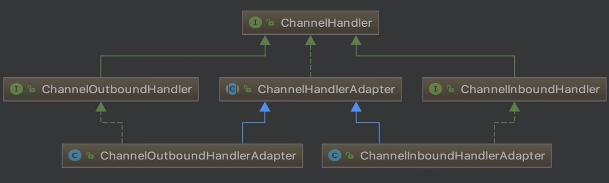
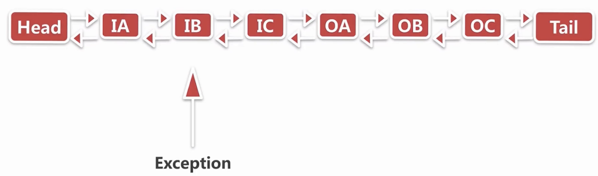

# Netty源码分析（七）：Pipeline事件与异常的传播

## 1. 两个问题

1. 对于`ChannelHandler`的添加应该遵循什么样的顺序
2. 用户手动触发事件传播，不同的触发方式有什么区别

## 2. InBound事件的传播

主要分为三个部分： 1. `ChannelInBoundHandler` 2. `ChannelRead`事件的传播 3. `SimpleInBoundHandler`处理器

### 2.1. ChannelInBoundHandler



ChannelHandler接口的主要方法，主要是和Handler自身相关的一些方法：

```java
public interface ChannelHandler {

    void handlerAdded(ChannelHandlerContext ctx) throws Exception;

    void handlerRemoved(ChannelHandlerContext ctx) throws Exception;

    @Deprecated
    void exceptionCaught(ChannelHandlerContext ctx, Throwable cause) throws Exception;

    @Inherited
    @Documented
    @Target(ElementType.TYPE)
    @Retention(RetentionPolicy.RUNTIME)
    @interface Sharable {
        // no value
    }
}
```

`ChannelInBoundHandler`主要是在`ChannelHandler`的基础上，新增了一些方法，这些方法是和具体业务逻辑相关的：

```java
public interface ChannelInboundHandler extends ChannelHandler {

    void channelRegistered(ChannelHandlerContext ctx) throws Exception;

    void channelUnregistered(ChannelHandlerContext ctx) throws Exception;

    void channelActive(ChannelHandlerContext ctx) throws Exception;

    void channelInactive(ChannelHandlerContext ctx) throws Exception;

    void channelRead(ChannelHandlerContext ctx, Object msg) throws Exception;

    void channelReadComplete(ChannelHandlerContext ctx) throws Exception;

    void userEventTriggered(ChannelHandlerContext ctx, Object evt) throws Exception;

    void channelWritabilityChanged(ChannelHandlerContext ctx) throws Exception;

    @Override
    @SuppressWarnings("deprecation")
    void exceptionCaught(ChannelHandlerContext ctx, Throwable cause) throws Exception;
}
```

### 2.2. ChannelRead事件的传播

考虑这段代码：

```java
ServerBootstrap b = new ServerBootstrap();
    b.group(bossGroup, workerGroup)
            .channel(NioServerSocketChannel.class)
            .childOption(ChannelOption.TCP_NODELAY, true)
            .childAttr(AttributeKey.newInstance("childAttr"), "childAttrValue")
            .childHandler(new ChannelInitializer<SocketChannel>() {
                @Override
                public void initChannel(SocketChannel ch) {
                    ch.pipeline().addLast(new InBoundHandlerA());
                    ch.pipeline().addLast(new InBoundHandlerC());
                    ch.pipeline().addLast(new InBoundHandlerB());
                }
            });

    ChannelFuture f = b.bind(8888).sync();

    f.channel().closeFuture().sync();
```

三个Handler：

```java
public class InBoundHandlerA extends ChannelInboundHandlerAdapter {

    @Override
    public void channelRead(ChannelHandlerContext ctx, Object msg) throws Exception {
        System.out.println("InBoundHandlerA: " + msg);
        ctx.fireChannelRead(msg);
    }
}
```

```java
public class InBoundHandlerC extends ChannelInboundHandlerAdapter {
    @Override
    public void channelRead(ChannelHandlerContext ctx, Object msg) throws Exception {
        System.out.println("InBoundHandlerC: " + msg);
        ctx.fireChannelRead(msg);
    }
}
```

```java
public class InBoundHandlerB extends ChannelInboundHandlerAdapter {
    @Override
    public void channelRead(ChannelHandlerContext ctx, Object msg) throws Exception {
        System.out.println("InBoundHandlerB: " + msg);
        ctx.fireChannelRead(msg);
    }

    @Override
    public void channelActive(ChannelHandlerContext ctx) {
        ctx.channel().pipeline().fireChannelRead("hello world");
    }
}
```

handler链如图： 


连接接入后，Netty创建连接，调用`InBoundHandlerB的channelActive`方法，继而调用`ctx.channel().pipeline().fireChannelRead("hello world");`，跟进查看：

```java
public final ChannelPipeline fireChannelRead(Object msg) {
    AbstractChannelHandlerContext.invokeChannelRead(head, msg);
    return this;
}
```

可以看到`pipeline`的`fireChannelRead`从头结点开始传播`read`事件，继续查看：

```java
static void invokeChannelRead(final AbstractChannelHandlerContext next, Object msg) {
    final Object m = next.pipeline.touch(ObjectUtil.checkNotNull(msg, "msg"), next);
    EventExecutor executor = next.executor();
    if (executor.inEventLoop()) {
        next.invokeChannelRead(m);
    } else {
        executor.execute(new Runnable() {
            @Override
            public void run() {
                next.invokeChannelRead(m);
            }
        });
    }
}

private void invokeChannelRead(Object msg) {
    if (invokeHandler()) {
        try {
            ((ChannelInboundHandler) handler()).channelRead(this, msg);
        } catch (Throwable t) {
            notifyHandlerException(t);
        }
    } else {
        fireChannelRead(msg);
    }
}
```

继续调用`((ChannelInboundHandler) handler()).channelRead(this, msg)`，注意这里的`next`是`head`节点，跟进：

```java
public void channelRead(ChannelHandlerContext ctx, Object msg) throws Exception {
    ctx.fireChannelRead(msg);
}
```

调用了`ctx.fireChannelRead(msg)`。`ctx`和`pipeline`都有`fireChannelRead`方法，但是`ctx`从当前位置开始传播，而`pipeline`从`head`开始传播。

```java
public ChannelHandlerContext fireChannelRead(final Object msg) {
    invokeChannelRead(findContextInbound(), msg);
    return this;
}

private AbstractChannelHandlerContext findContextInbound() {
    AbstractChannelHandlerContext ctx = this;
    do {
        ctx = ctx.next;
    } while (!ctx.inbound);
    return ctx;
}
```

即`head`将read事件传播到了`HandlerA`中，并且调用了`HandlerA`的`channelRead`方法。在其`ChannelRead`方法中继续调用`ctx.fireChannelRead(msg)`，将read事件传播到`HandlerC`中，再到`HandlerB`中，最后到`tail`中，在`tail`中打印未处理的read事件并且release相关bytebuf。

至于`Handler`是`inBound`还是`outBound`的识别方式，则是通过`inbound`变量和`outbound`变量，在创建Context时根据Handler类型进行确定：

```java
DefaultChannelHandlerContext(
        DefaultChannelPipeline pipeline, EventExecutor executor, String name, ChannelHandler handler) {
    super(pipeline, executor, name, isInbound(handler), isOutbound(handler));
    if (handler == null) {
        throw new NullPointerException("handler");
    }
    this.handler = handler;
}

private static boolean isInbound(ChannelHandler handler) {
    return handler instanceof ChannelInboundHandler;
}

private static boolean isOutbound(ChannelHandler handler) {
    return handler instanceof ChannelOutboundHandler;
}
```

### 2.3. SimpleInBoundHandler处理器

* 由上可知，当传入的msg是`ByteBuf`时，如果前面的Handler没有处理这个msg并且传播到了`tail`节点，`tail`节点会释放内存。但是如果Handler处理了msg但是没有释放`ByteBuf`的话，就会造成内存泄漏。
* `SimpleInBoundHandler`处理器封装了这些逻辑。以AuthHandler为例，这个类继承了`SimpleChannelInboundHandler<ByteBuf>`。传入的泛型为`ByteBuf`。

查看`SimpleInBoundHandler`的`channelRead`方法：

```java
public void channelRead(ChannelHandlerContext ctx, Object msg) throws Exception {
    boolean release = true;
    try {
        if (acceptInboundMessage(msg)) {
            @SuppressWarnings("unchecked")
            I imsg = (I) msg;
            channelRead0(ctx, imsg);
        } else {
            release = false;
            ctx.fireChannelRead(msg);
        }
    } finally {
        if (autoRelease && release) {
            ReferenceCountUtil.release(msg);
        }
    }
}
```

* 如果handler接收该msg，则调用`channelRead0`方法，这个方法是抽象方法，需要由用户自己编码实现。
* 在`finally`中，使用`ReferenceCountUtil.release(msg)`进行释放。

## 3. OutBound事件的传播

1. `ChannelOutBoundHandler`
2. `write`事件的传播

### 3.1. ChannelOutBoundHandler

首先看一下`ChannelOutBoundHandler`的相关代码：

```java
public interface ChannelOutboundHandler extends ChannelHandler {

    void bind(ChannelHandlerContext ctx, SocketAddress localAddress, ChannelPromise promise) throws Exception;

    void connect(
            ChannelHandlerContext ctx, SocketAddress remoteAddress,
            SocketAddress localAddress, ChannelPromise promise) throws Exception;

    void disconnect(ChannelHandlerContext ctx, ChannelPromise promise) throws Exception;

    void close(ChannelHandlerContext ctx, ChannelPromise promise) throws Exception;

    void deregister(ChannelHandlerContext ctx, ChannelPromise promise) throws Exception;

    void read(ChannelHandlerContext ctx) throws Exception;

    void write(ChannelHandlerContext ctx, Object msg, ChannelPromise promise) throws Exception;

    void flush(ChannelHandlerContext ctx) throws Exception;
}
```

与`ChannelInBoundHandler`相比，`ChannelOutBoundHandler`更多的是对用于的操作进行一个响应。而`ChannelInBoundHandler`更像是通过事件来进行触发的。

### 3.2. write事件的传播

* 在传播方向上，`OutBound`事件是由`tail`向`head`传播的，这与`InBound`是相反的。
* 其他逻辑与`InBound`相似，这里不多做进行分析。

  \*\*\*\*

## **4. 异常的传播**

主要分为两个部分：

* 异常的触发链
* 异常处理的最佳实践

以以下代码为例：

```java
ServerBootstrap b = new ServerBootstrap();
    b.group(bossGroup, workerGroup)
            .channel(NioServerSocketChannel.class)
            .childOption(ChannelOption.TCP_NODELAY, true)
            .childAttr(AttributeKey.newInstance("childAttr"), "childAttrValue")
            .childHandler(new ChannelInitializer<SocketChannel>() {
                @Override
                public void initChannel(SocketChannel ch) {
                    ch.pipeline().addLast(new InBoundHandlerA());
                    ch.pipeline().addLast(new InBoundHandlerB());
                    ch.pipeline().addLast(new InBoundHandlerC());
                    ch.pipeline().addLast(new OutBoundHandlerA());
                    ch.pipeline().addLast(new OutBoundHandlerB());
                    ch.pipeline().addLast(new OutBoundHandlerC());
                    ch.pipeline().addLast(new ExceptionCaughtHandler());
                }
            });

    ChannelFuture f = b.bind(8888).sync();

    f.channel().closeFuture().sync();
```

在接收到消息之后，只有`InBoundHandlerB()`覆写了`channelRead`方法，且在方法中会抛出异常。六个Handler全部都override了`exceptionCaught`方法并且将异常继续传播。 



### 4.1. 异常的触发链

首先看`invokeChannelRead`方法：

```java
private void invokeChannelRead(Object msg) {
    if (invokeHandler()) {
        try {
            ((ChannelInboundHandler) handler()).channelRead(this, msg);
        } catch (Throwable t) {
            notifyHandlerException(t);
        }
    } else {
        fireChannelRead(msg);
    }
}
```

由于在`InBoundHandlerB()`的`channelRead`中抛出异常，系统进行catch，执行`notifyHandlerException`：

```java
private void notifyHandlerException(Throwable cause) {
    if (inExceptionCaught(cause)) {
        if (logger.isWarnEnabled()) {
            logger.warn(
                    "An exception was thrown by a user handler " +
                            "while handling an exceptionCaught event", cause);
        }
        return;
    }

    invokeExceptionCaught(cause);
}
```

继续跟进`invokeExceptionCaught`：

```java
private void invokeExceptionCaught(final Throwable cause) {
    if (invokeHandler()) {
        try {
            handler().exceptionCaught(this, cause);
        } catch (Throwable error) {
            // ***
        }
    } else {
        fireExceptionCaught(cause);
    }
}
```

可以看到，会调用到ctx对应的handler的`exceptionCaught`方法。如果handler的`exceptionCaught`方法中继续调用了`fireExceptionCaught(cause)`进行异常传播：

```java
public ChannelHandlerContext fireExceptionCaught(final Throwable cause) {
    invokeExceptionCaught(next, cause);
    return this;
}
```

即传播到了next节点。这个next是ctx的一个成员变量，指向pipeline中的下一个节点，即指向tail方向的下一个节点。 即**Exception的传播与InBound还是OutBound无关，全部都是往tail方向进行传播**。

### 4.2. 异常处理的最佳实践

可以在最后加一个节点，用于处理前面出现的异常。这样所有的异常都可以回到该节点进行处理。 例如在最后添加一个:

```java
public class ExceptionCaughtHandler extends ChannelInboundHandlerAdapter {
    @Override
    public void exceptionCaught(ChannelHandlerContext ctx, Throwable cause) throws Exception {
        // ..

        if (cause instanceof BusinessException) {
            System.out.println("BusinessException");
        }
    }
}
```

