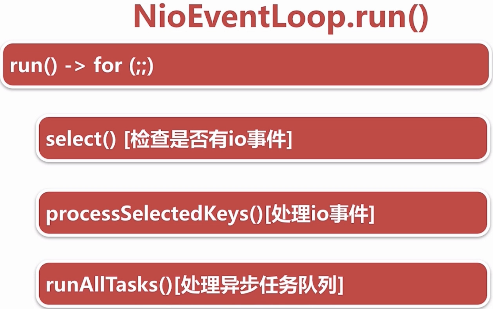

# Netty源码分析（三）：NioEventLoop的执行逻辑

## 1. 相关代码

`run()`方法的代码为：

```java
protected void run() {
    for (;;) {
        try {
            // 轮询IO事件
            switch (selectStrategy.calculateStrategy(selectNowSupplier, hasTasks())) {
                case SelectStrategy.CONTINUE:
                    continue;
                case SelectStrategy.SELECT:
                    select(wakenUp.getAndSet(false));

                    // 'wakenUp.compareAndSet(false, true)' is always evaluated
                    // before calling 'selector.wakeup()' to reduce the wake-up
                    // overhead. (Selector.wakeup() is an expensive operation.)
                    //
                    // However, there is a race condition in this approach.
                    // The race condition is triggered when 'wakenUp' is set to
                    // true too early.
                    //
                    // 'wakenUp' is set to true too early if:
                    // 1) Selector is waken up between 'wakenUp.set(false)' and
                    //    'selector.select(...)'. (BAD)
                    // 2) Selector is waken up between 'selector.select(...)' and
                    //    'if (wakenUp.get()) { ... }'. (OK)
                    //
                    // In the first case, 'wakenUp' is set to true and the
                    // following 'selector.select(...)' will wake up immediately.
                    // Until 'wakenUp' is set to false again in the next round,
                    // 'wakenUp.compareAndSet(false, true)' will fail, and therefore
                    // any attempt to wake up the Selector will fail, too, causing
                    // the following 'selector.select(...)' call to block
                    // unnecessarily.
                    //
                    // To fix this problem, we wake up the selector again if wakenUp
                    // is true immediately after selector.select(...).
                    // It is inefficient in that it wakes up the selector for both
                    // the first case (BAD - wake-up required) and the second case
                    // (OK - no wake-up required).

                    if (wakenUp.get()) {
                        selector.wakeup();
                    }
                default:
                    // fallthrough
            }

            cancelledKeys = 0;
            needsToSelectAgain = false;
            // 用来指定processSelectedKeys()和runAllTasks()执行时间比例，默认为50，即占比为1:1
            final int ioRatio = this.ioRatio;
            if (ioRatio == 100) {
                try {
                    // 处理IO事件
                    processSelectedKeys();
                } finally {
                    // Ensure we always run tasks.
                    // 处理外部线程扔到该EventLoop的任务
                    runAllTasks();
                }
            } else {
                final long ioStartTime = System.nanoTime();
                try {
                    processSelectedKeys();
                } finally {
                    // Ensure we always run tasks.
                    final long ioTime = System.nanoTime() - ioStartTime;
                    runAllTasks(ioTime * (100 - ioRatio) / ioRatio);
                }
            }
        } catch (Throwable t) {
            handleLoopException(t);
        }
        // Always handle shutdown even if the loop processing threw an exception.
        try {
            if (isShuttingDown()) {
                closeAll();
                if (confirmShutdown()) {
                    return;
                }
            }
        } catch (Throwable t) {
            handleLoopException(t);
        }
    }
}
```

## 2. 两个问题

1. Netty是如何解决JKD的空轮训BUG的？
2. Netty如何保证异步串行无锁化？

## 3. NioEventLoop的执行逻辑



首先看一下calculateStrategy\(\)方法：

```java
public int calculateStrategy(IntSupplier selectSupplier, boolean hasTasks) throws Exception {
    return hasTasks ? selectSupplier.get() : SelectStrategy.SELECT;
}
```

继续看selectSupplier.get\(\)：

```java
private final IntSupplier selectNowSupplier = new IntSupplier() {
    public int get() throws Exception {
        return NioEventLoop.this.selectNow();
    }
};
```

当`selectNow()`没有轮询到新事件时，返回0。 即`switch`内的内容表示：

* 当`hasTask()`返回`true`，即表示当前任务队列有异步任务需要执行时，进行`selectNow()`的非阻塞轮询。如果轮询到事件，返回`SelectStrategy.SELECT`（值为-1），否则返回0（表示这次的select没有轮询到事件）。
* 当`hasTask()`返回`false`，即表示当前任务队列没有异步任务需要执行，返回`SelectStrategy.SELECT`。

当值为`SelectStrategy.SELECT`，表示没有IO事件，也没有异步任务，此时执行select去等待新的IO事件。否则去执行后续的逻辑，进行IO事件和异步任务的处理。

### 3.1. wakenUp变量

#### 3.1.1. wakeup\(\)方法

首先查看`Selector.wakeup()`方法的注释：

> /\*\*
>
> * Causes the first selection operation that has not yet returned to return
> * immediately.
>
>   \*
>
> *  If another thread is currently blocked in an invocation of the
> * {@link \#select\(\)} or {@link \#select\(long\)} methods then that invocation
> * will return immediately.  If no selection operation is currently in
> * progress then the next invocation of one of these methods will return
> * immediately unless the {@link \#selectNow\(\)} method is invoked in the
> * meantime.  In any case the value returned by that invocation may be
> * non-zero.  Subsequent invocations of the {@link \#select\(\)} or {@link
> * **select\(long\)} methods will block as usual unless this method is invoked**
> * again in the meantime.
>
>   \*
>
> *  Invoking this method more than once between two successive selection
> * operations has the same effect as invoking it just once.  &lt;/p&gt;
>
>   \*
>
> * @return  This selector
>
>   \*/

`wakeup()`会让尚未返回的第一个select操作立即返回。

如果执行`wakeup()`时，没有正在进行的`select`操作，那么**除非在此期间调用了**`selectNow()` **方法**，否则将立即返回下一次的`select`调用。`select()`，`select(long)`方法的后续调用将像往常一样发生阻塞，除非在此期间再次调用`wakeup()`方法。

在两个连续的`select`操作之间多次调用`wakeup()`方法与仅调用一次具有相同的效果。

> Selector.wakeup\(\) is an expensive operation.

另外还有一点值得注意的是，`Selector.wakeup()`是一个十分昂贵的操作，而两个连续的`select`操作之间多次调用`wakeup()`方法与仅调用一次具有相同的效果，因此为了得到更高的效率，我们**希望wakeup\(\)在两次select之间只被调用一次**。

因此引入了一个`AtomicBoolean`类的`wakenUp`变量。

#### 3.1.2. wakenUp.compareAndSet\(false, true\)

首先看一下`NioEventLoop`类中封装的一个`wakeup()`方法：

```java
protected void wakeup(boolean inEventLoop) {
    if (!inEventLoop && wakenUp.compareAndSet(false, true)) {
        selector.wakeup();
    }
}
```

即要唤醒select操作，需要满足： 1. 从外部唤醒 2. 目前`wakenUp`变量的值为`false`

从第二点可以看出，连续两次的`NioEventLoop`的`wakeup()`的调用，实际上只有一次会真正调用到`selector.wakeup()`，也就解决了上面重复调用而真正的`selector.wakeup()`操作又十分昂贵的问题。在需要唤醒时，需要将`wakenUp`变量重新赋值为`false`。

#### 3.1.3. 引发的问题

`NioEventLoop`的操作逻辑简化一下：

```java
while(true){

    wakeUp.set(false); //A

    select(timeout); //B

    processSelectedKeys(); //C

    runAllTasks(); //D

}
```

考虑这个场景：

> 1. `wakenUp.compareAndSet(false, true)`在A到B之间被调用,也就是说操作B的select会立刻返回
> 2. 在D和下一次循环的A之间，执行了`NioEventLoop`类的`execute(task)`，往Queue里新添了一个task（记为T），并且尝试调用`wakeup()`
> 3. 由于1的原因，导致这个时候的`wakenUp`变量为`true`，所以2中的`wakeup()`是无效的，同时任务T只能留到下一次的循环中执行
> 4. 第二次循环中，如3中所述，`Selector.wakeup()`是没有真正调用的，也就是说在B中会发生堵塞
> 5. T的提交和T的执行之间至少有了一个`timeout`的延时，即堵塞的超时时间，而这个时间在某些情况下是不能忍受的

#### 3.1.4. 解决方法

Netty的解决方案如下，在AB和CD之间增加了一个M过程：

```java
while(true){

    wakeUp.set(false); //A

    select(timeout); //B

    if (wakenUp.get()) { //M
        selector.wakeup();
    }

    processSelectedKeys(); //C

    runAllTasks(); //D

}
```

重新考虑上面的场景：

* 在1操作和2操作之间，增加了M，因为在1中已经将`wakenUp`置为`true`，因此会调用`selector.wakeup()`
* 由于在B之后又调用了一次`selector.wakeup()`，所以在下一次循环中，select操作会立刻返回
* 在M之后添加的任务，由于下一次的select会立刻返回，就不存在需要等待`timeout`的情况了

不过，这种方法有时候并不是那么有效率。当在场景中的2步骤不发生时，其实是没有必要进行`selector.wakeup()`的

### 3.2. Select\(\)检测IO事件

主要有三个要点： 1. Deadline以及任务穿插逻辑处理 2. 阻塞式select 3. 解决JDK空轮询BUG（通过重建selector）

```java
private void select(boolean oldWakenUp) throws IOException {
    Selector selector = this.selector;
    try {
        int selectCnt = 0;
        long currentTimeNanos = System.nanoTime();
        // delayNanos()方法会获取scheduled任务队列中，第一个元素的截止时间。
        // 获取select操作的最晚的执行完成时间
        long selectDeadLineNanos = currentTimeNanos + delayNanos(currentTimeNanos);
        for (;;) {
            // 将timeout转化为毫秒为单位，并且进行四舍五入,这个timeout是select操作的timeout
            long timeoutMillis = (selectDeadLineNanos - currentTimeNanos + 500000L) / 1000000L;
            // 如果超时的话，表示该跳出select操作去执行定时任务了
            if (timeoutMillis <= 0) {
                // 且一次select都没有进行
                if (selectCnt == 0) {
                    // 执行非阻塞的select方法 
                    selector.selectNow();
                    selectCnt = 1;
                }
                break;
            }

            // If a task was submitted when wakenUp value was true, the task didn't get a chance to call
            // Selector#wakeup. So we need to check task queue again before executing select operation.
            // If we don't, the task might be pended until select operation was timed out.
            // It might be pended until idle timeout if IdleStateHandler existed in pipeline.
            // 目前任务队列中有任务，该结束select操作去执行普通的非定时任务了。
            // 如果在switch (selectStrategy.calculateStrategy(selectNowSupplier, hasTasks()))
            // 和select(wakenUp.getAndSet(false));两个过程之间
            // 执行了添加任务的操作，且添加任务时WakenUp为true，则之后的select不会立刻返回
            // 该任务也就需要等待一个timeout才能执行，因此需要增加这个判断
            // （添加任务时WakenUp为true，则在select(wakenUp.getAndSet(false))之后
            // 会调用一个Selector.wakeup()，此时接下来的selector.select(timeoutMillis)
            // 按理不会堵塞。但是之后，如果在switch (selectStrategy.calculateStrategy(selectNowSupplier, hasTasks()))过程中，发现有任务，会调用
            // selectSupplier.get()，其中包含selectNow操作会使得wakeup失效，还是有可能阻塞）。
            // 如果是在进入select(wakenUp.getAndSet(false))之后添加的任务导致hasTasks()，
            // selector.select(timeoutMillis)会正常地立刻返回，因此无需进入if语句的内部，
            // 即此时有wakenUp.compareAndSet(false, true)为false
            if (hasTasks() && wakenUp.compareAndSet(false, true)) {
                selector.selectNow();
                selectCnt = 1;
                break;
            }

            // 不用执行定时任务和普通任务，堵塞select
            int selectedKeys = selector.select(timeoutMillis);
            selectCnt ++;

            // 如果轮询到事件或者有任务，直接跳出去执行任务
            if (selectedKeys != 0 || oldWakenUp || wakenUp.get() || hasTasks() || hasScheduledTasks()) {
                // - Selected something,
                // - waken up by user（oldWakenUp || wakenUp.get()部分，因为用户wakeup可能发生在任何地方）, or
                // - the task queue has a pending task.
                // - a scheduled task is ready for processing
                break;
            }
            if (Thread.interrupted()) {
                // Thread was interrupted so reset selected keys and break so we not run into a busy loop.
                // As this is most likely a bug in the handler of the user or it's client library we will
                // also log it.
                //
                // See https://github.com/netty/netty/issues/2426
                if (logger.isDebugEnabled()) {
                    logger.debug("Selector.select() returned prematurely because " +
                            "Thread.currentThread().interrupt() was called. Use " +
                            "NioEventLoop.shutdownGracefully() to shutdown the NioEventLoop.");
                }
                selectCnt = 1;
                break;
            }

            long time = System.nanoTime();
            if (time - TimeUnit.MILLISECONDS.toNanos(timeoutMillis) >= currentTimeNanos) {
                // timeoutMillis elapsed without anything selected.
                selectCnt = 1;
                // timeoutMills的阻塞时间消失了，然而并没有轮询到selectedKeys，
                // 说明发生了epoll的空轮询BUG导致select的阻塞过程消失了
            } else if (SELECTOR_AUTO_REBUILD_THRESHOLD > 0 &&
                    selectCnt >= SELECTOR_AUTO_REBUILD_THRESHOLD) {
                // The selector returned prematurely many times in a row.
                // Rebuild the selector to work around the problem.
                logger.warn(
                        "Selector.select() returned prematurely {} times in a row; rebuilding Selector {}.",
                        selectCnt, selector);

                // 重建selector
                rebuildSelector();
                selector = this.selector;

                // Select again to populate selectedKeys.
                selector.selectNow();
                selectCnt = 1;
                break;
            }

            currentTimeNanos = time;
        }

        if (selectCnt > MIN_PREMATURE_SELECTOR_RETURNS) {
            if (logger.isDebugEnabled()) {
                logger.debug("Selector.select() returned prematurely {} times in a row for Selector {}.",
                        selectCnt - 1, selector);
            }
        }
    } catch (CancelledKeyException e) {
        if (logger.isDebugEnabled()) {
            logger.debug(CancelledKeyException.class.getSimpleName() + " raised by a Selector {} - JDK bug?",
                    selector, e);
        }
        // Harmless exception - log anyway
    }
}
```

#### 3.2.1. Deadline以及任务穿插逻辑处理

首先是第一步，需要获取到`ScheduledTaskQueue`中处于第一个位置的任务的deadline，即表示该任务在时间到达deadline后需要执行了，因此select操作的阻塞在事件到达任务的deadline前需要结束，让逻辑回到执行scheduledTask上。

另外，当`TaskQueue`中有任务时，需要唤醒select操作，立刻执行该任务。

#### 3.2.2. 阻塞式select

`select(timeout)`会在timeout后返回，或者被**添加任务的操作**和**用户唤醒**并且立刻返回。

#### 3.2.3. 解决空轮询BUG

* 正常情况下，`selector.select()`操作是阻塞的，只有被监听的fd有读写操作时，才被唤醒
* 但是，在这个bug中，没有任何fd有读写请求，但是select\(\)操作依旧被唤醒
* 很显然，这种情况下，`selectedKeys()`返回的是个空数组
* 然后按照逻辑执行到for \(;;\)处，循环执行，导致死循环

Netty的解决办法是创建一个新的`Selector`：

> Trash wasted Selector, creates a new one.

### 3.3. 处理IO事件

主要有两个点： 1. `selectedKeys`的优化 2. `processSelectedKeysOptimized()`

#### 3.3.1. selectedKeys的优化

```java
private Selector openSelector() {
    final Selector selector;
    try {
        selector = provider.openSelector();
    } catch (IOException e) {
        throw new ChannelException("failed to open a new selector", e);
    }

    // 判断是否优化
    if (DISABLE_KEYSET_OPTIMIZATION) {
        return selector;
    }

    // 获取新的SelectedSelectionKeySet
    final SelectedSelectionKeySet selectedKeySet = new SelectedSelectionKeySet();

    // 通过反射获得一个Selector类的实现：SelectorImpl
    Object maybeSelectorImplClass = AccessController.doPrivileged(new PrivilegedAction<Object>() {
        @Override
        public Object run() {
            try {
                return Class.forName(
                        "sun.nio.ch.SelectorImpl",
                        false,
                        PlatformDependent.getSystemClassLoader());
            } catch (ClassNotFoundException e) {
                return e;
            } catch (SecurityException e) {
                return e;
            }
        }
    });

    // 异常检测
    if (!(maybeSelectorImplClass instanceof Class) ||
            // ensure the current selector implementation is what we can instrument.
            !((Class<?>) maybeSelectorImplClass).isAssignableFrom(selector.getClass())) {
        if (maybeSelectorImplClass instanceof Exception) {
            Exception e = (Exception) maybeSelectorImplClass;
            logger.trace("failed to instrument a special java.util.Set into: {}", selector, e);
        }
        return selector;
    }

    final Class<?> selectorImplClass = (Class<?>) maybeSelectorImplClass;

    // 修改获得的Selector实例selector的selectedKeys字段和publicSelectedKeys字段为
    // 我们新建的SelectedSelectionKeySet
    Object maybeException = AccessController.doPrivileged(new PrivilegedAction<Object>() {
        @Override
        public Object run() {
            try {
                // 通过selectorImplClass获取到相应的字段
                Field selectedKeysField = selectorImplClass.getDeclaredField("selectedKeys");
                Field publicSelectedKeysField = selectorImplClass.getDeclaredField("publicSelectedKeys");

                // 设置字段可见性
                selectedKeysField.setAccessible(true);
                publicSelectedKeysField.setAccessible(true);

                // 修改字段
                selectedKeysField.set(selector, selectedKeySet);
                publicSelectedKeysField.set(selector, selectedKeySet);
                return null;
            } catch (NoSuchFieldException e) {
                return e;
            } catch (IllegalAccessException e) {
                return e;
            } catch (RuntimeException e) {
                // JDK 9 can throw an inaccessible object exception here; since Netty compiles
                // against JDK 7 and this exception was only added in JDK 9, we have to weakly
                // check the type
                if ("java.lang.reflect.InaccessibleObjectException".equals(e.getClass().getName())) {
                    return e;
                } else {
                    throw e;
                }
            }
        }
    });

    // 异常检测
    if (maybeException instanceof Exception) {
        selectedKeys = null;
        Exception e = (Exception) maybeException;
        logger.trace("failed to instrument a special java.util.Set into: {}", selector, e);
    } else {
        // 将selector的selectedKeySet变量同时赋值给EventLoop的selectedKeys变量
        selectedKeys = selectedKeySet;
        logger.trace("instrumented a special java.util.Set into: {}", selector);
    }

    // 返回selector
    return selector;
}
```

* 首先Netty会打开一个`Selector`，接着判断是否进行优化。
* 如果进行优化，新建一个`SelectedSelectionKeySet`，用于替代原先`Selector`中的selectedKeys集合（这是一个`Set<SelectionKey>`）。因为不支持`remove`和`contains`等操作，所以`SelectedSelectionKeySet`可以直接通过数组来实现。
* 如果不优化，直接返回获得的`selector`

`SelectedSelectionKeySet`的大致逻辑如下：

```java
private SelectionKey[] keysA;
private int keysASize;

SelectedSelectionKeySet() {
    keysA = new SelectionKey[1024];
}

public boolean add(SelectionKey o) {
    if (o == null) {
        return false;
    }

    int size = keysASize;
    keysA[size ++] = o;
    keysASize = size;
    if (size == keysA.length) {
        doubleCapacityA();
    }

    return true;
}

// ***
```

* 获取到`SelectedSelectionKeySet`后，首先通过反射获得`SelectorImpl`类，找到其中的`selectedKeys`字段和`publicSelectedKeys`字段。
* 修改两个字段的可见性
* 将`selector`的`selectedKeys`字段和`publicSelectedKeys`字段修改为指向优化后的`SelectedSelectionKeySet`
* 返回优化后的`selector`

#### 3.3.2. processSelectedKeysOptimized\(\)

```java
private void processSelectedKeys() {
    // 判断是否进行了优化
    if (selectedKeys != null) {
        // 获取SelectedSelectionKeySet中的数组对象
        processSelectedKeysOptimized(selectedKeys.flip());
    } else {
        processSelectedKeysPlain(selector.selectedKeys());
    }
}
```

这里我们主要查看`processSelectedKeysOptimized()`方法：

```java
private void processSelectedKeysOptimized(SelectionKey[] selectedKeys) {
    for (int i = 0;; i ++) {
        final SelectionKey k = selectedKeys[i];
        if (k == null) {
            break;
        }
        // null out entry in the array to allow to have it GC'ed once the Channel close
        // See https://github.com/netty/netty/issues/2363
        selectedKeys[i] = null;

        // 在之前的注册register中，我们将Netty封装的Channel类作为attachment
        final Object a = k.attachment();

        if (a instanceof AbstractNioChannel) {
            processSelectedKey(k, (AbstractNioChannel) a);
        } else {
            @SuppressWarnings("unchecked")
            NioTask<SelectableChannel> task = (NioTask<SelectableChannel>) a;
            processSelectedKey(k, task);
        }

        if (needsToSelectAgain) {
            // null out entries in the array to allow to have it GC'ed once the Channel close
            // See https://github.com/netty/netty/issues/2363
            for (;;) {
                i++;
                if (selectedKeys[i] == null) {
                    break;
                }
                selectedKeys[i] = null;
            }

            selectAgain();
            // Need to flip the optimized selectedKeys to get the right reference to the array
            // and reset the index to -1 which will then set to 0 on the for loop
            // to start over again.
            //
            // See https://github.com/netty/netty/issues/1523
            selectedKeys = this.selectedKeys.flip();
            i = -1;
        }
    }
}
```

我们继续点击到`processSelectedKey(k, (AbstractNioChannel) a)`查看代码：

```java
private void processSelectedKey(SelectionKey k, AbstractNioChannel ch) {
    final AbstractNioChannel.NioUnsafe unsafe = ch.unsafe();
    // 如果key是无效的，说明连接可能有问题，直接关闭
    if (!k.isValid()) {
        final EventLoop eventLoop;
        try {
            eventLoop = ch.eventLoop();
        } catch (Throwable ignored) {
            // If the channel implementation throws an exception because there is no event loop, we ignore this
            // because we are only trying to determine if ch is registered to this event loop and thus has authority
            // to close ch.
            return;
        }
        // Only close ch if ch is still registerd to this EventLoop. ch could have deregistered from the event loop
        // and thus the SelectionKey could be cancelled as part of the deregistration process, but the channel is
        // still healthy and should not be closed.
        // See https://github.com/netty/netty/issues/5125
        if (eventLoop != this || eventLoop == null) {
            return;
        }
        // close the channel if the key is not valid anymore
        unsafe.close(unsafe.voidPromise());
        return;
    }

    try {
        // 读取获取到的key中IO事件
        int readyOps = k.readyOps();
        // We first need to call finishConnect() before try to trigger a read(...) or write(...) as otherwise
        // the NIO JDK channel implementation may throw a NotYetConnectedException.
        if ((readyOps & SelectionKey.OP_CONNECT) != 0) {
            // remove OP_CONNECT as otherwise Selector.select(..) will always return without blocking
            // See https://github.com/netty/netty/issues/924
            int ops = k.interestOps();
            ops &= ~SelectionKey.OP_CONNECT;
            k.interestOps(ops);

            unsafe.finishConnect();
        }

        // Process OP_WRITE first as we may be able to write some queued buffers and so free memory.
        if ((readyOps & SelectionKey.OP_WRITE) != 0) {
            // Call forceFlush which will also take care of clear the OP_WRITE once there is nothing left to write
            ch.unsafe().forceFlush();
        }

        // Also check for readOps of 0 to workaround possible JDK bug which may otherwise lead
        // to a spin loop
        if ((readyOps & (SelectionKey.OP_READ | SelectionKey.OP_ACCEPT)) != 0 || readyOps == 0) {
            unsafe.read();
            if (!ch.isOpen()) {
                // Connection already closed - no need to handle write.
                return;
            }
        }
    } catch (CancelledKeyException ignored) {
        unsafe.close(unsafe.voidPromise());
    }
}
```

* 首先我们查看轮询到的key是否有效，无效则直接通过`unsafe`进行`channel`的关闭
* 读取key中代码的IO事件 
* 根据不同的事件执行不同的逻辑

### 3.4. 处理异步任务队列

这部分的内容： 1. **task的分类与添加。** task包括普通task和定时task。分别由两个queue进行存储。 2. **任务的聚合。** 在任务执行时，需要先把定时task聚合到普通task中。 3. **任务的执行。**

#### 3.4.1. task的分类与添加

首先是添加**普通task**的`addTask()`方法：

```java
protected void addTask(Runnable task) {
    if (task == null) {
        throw new NullPointerException("task");
    }
    if (!offerTask(task)) {
        reject(task);
    }
}

final boolean offerTask(Runnable task) {
    if (isShutdown()) {
        reject();
    }
    return taskQueue.offer(task);
}
```

这个`taskQueue`就是之前提到的`MpscQueue`。通过它的`offer()`进行任务的添加。

接着是**定时task**的`schedule(Callable<V> callable, long delay, TimeUnit unit)`方法：

```java
public <V> ScheduledFuture<V> schedule(Callable<V> callable, long delay, TimeUnit unit) {
    ObjectUtil.checkNotNull(callable, "callable");
    ObjectUtil.checkNotNull(unit, "unit");
    if (delay < 0) {
        throw new IllegalArgumentException(
                String.format("delay: %d (expected: >= 0)", delay));
    }
    return schedule(new ScheduledFutureTask<V>(
            this, callable, ScheduledFutureTask.deadlineNanos(unit.toNanos(delay))));
}
```

继续往下看`schedule(ScheduledFutureTask<V>)`方法：

```java
<V> ScheduledFuture<V> schedule(final ScheduledFutureTask<V> task) {
    if (inEventLoop()) {
        scheduledTaskQueue().add(task);
    } else {
        execute(new Runnable() {
            @Override
            public void run() {
                scheduledTaskQueue().add(task);
            }
        });
    }

    return task;
}
```

继续点击`scheduledTaskQueue()`：

```java
Queue<ScheduledFutureTask<?>> scheduledTaskQueue() {
    if (scheduledTaskQueue == null) {
        scheduledTaskQueue = new PriorityQueue<ScheduledFutureTask<?>>();
    }
    return scheduledTaskQueue;
}
```

由于`PriorityQueue`是非线程安全的，所以需要考虑线程安全的问题。**Netty的解决方式**是：通过判断`inEventLoop()`，来选择`add(task)`的方式。保证调用`scheduledTaskQueue().add(task)`的始终是同一个线程，这样就保证了串行化。

#### 3.4.2. 任务的聚合

首先查看`runAllTasks(long timeoutNanos)`方法。

```java
protected boolean runAllTasks(long timeoutNanos) {
    fetchFromScheduledTaskQueue();
    Runnable task = pollTask();
    if (task == null) {
        afterRunningAllTasks();
        return false;
    }

    final long deadline = ScheduledFutureTask.nanoTime() + timeoutNanos;
    long runTasks = 0;
    long lastExecutionTime;
    for (;;) {
        safeExecute(task);

        runTasks ++;

        // Check timeout every 64 tasks because nanoTime() is relatively expensive.
        // XXX: Hard-coded value - will make it configurable if it is really a problem.
        if ((runTasks & 0x3F) == 0) {
            lastExecutionTime = ScheduledFutureTask.nanoTime();
            if (lastExecutionTime >= deadline) {
                break;
            }
        }

        task = pollTask();
        if (task == null) {
            lastExecutionTime = ScheduledFutureTask.nanoTime();
            break;
        }
    }

    afterRunningAllTasks();
    this.lastExecutionTime = lastExecutionTime;
    return true;
}
```

任务的聚合任务由`fetchFromScheduledTaskQueue()`实现，点进去查看一下：

```java
private boolean fetchFromScheduledTaskQueue() {
    long nanoTime = AbstractScheduledEventExecutor.nanoTime();
    Runnable scheduledTask  = pollScheduledTask(nanoTime);
    while (scheduledTask != null) {
        if (!taskQueue.offer(scheduledTask)) {
            // No space left in the task queue add it back to the scheduledTaskQueue so we pick it up again.
            scheduledTaskQueue().add((ScheduledFutureTask<?>) scheduledTask);
            return false;
        }
        scheduledTask  = pollScheduledTask(nanoTime);
    }
    return true;
}
```

`scheduledTaskQueue`是一个优先级队列，也就是说`scheduledTaskQueue`是排序好的队列。查看队列元素`ScheduledFutureTask`的`compareTo`方法：

```java
public int compareTo(Delayed o) {
    if (this == o) {
        return 0;
    }

    ScheduledFutureTask<?> that = (ScheduledFutureTask<?>) o;
    long d = deadlineNanos() - that.deadlineNanos();
    if (d < 0) {
        return -1;
    } else if (d > 0) {
        return 1;
    } else if (id < that.id) {
        return -1;
    } else if (id == that.id) {
        throw new Error();
    } else {
        return 1;
    }
}
```

可以看到，`scheduledTaskQueue`是按照`ScheduledFutureTask`的deadline进行正序排列的。

现在回到`fetchFromScheduledTaskQueue()`方法，首先第一步是获取到当前的定时队列的`nanoTime`，接着，通过`pollScheduledTask(nanoTime)`返回第一个deadline小于`nanoTime`的task。如果没有则返回`null`。点进去查看代码如下：

```java
protected final Runnable pollScheduledTask(long nanoTime) {
    assert inEventLoop();

    Queue<ScheduledFutureTask<?>> scheduledTaskQueue = this.scheduledTaskQueue;
    ScheduledFutureTask<?> scheduledTask = scheduledTaskQueue == null ? null : scheduledTaskQueue.peek();
    if (scheduledTask == null) {
        return null;
    }

    if (scheduledTask.deadlineNanos() <= nanoTime) {
        scheduledTaskQueue.remove();
        return scheduledTask;
    }
    return null;
}
```

拿到定时任务后，将任务塞到普通任务队列中，一直到所有的准备好执行的定时任务都添加到普通任务队列中。如果定时任务添加失败了，需要把取出的定时任务重新添加回定时任务队列中。

目前为止，就实现了任务的聚合。

#### 3.4.3. 任务的执行

回到`runAllTasks(long timeoutNanos)`方法。主要是几个步骤：

1. 在任务完成聚合后，从任务队列中取出一个task。
2. 计算整个`runAllTasks(long timeoutNanos)`方法的deadline
3. 通过for\(;;\)循环执行任务。
4. `afterRunningAllTasks()`进行收尾工作

我们查看`safeExecute(Runnable task)`方法：

```java
protected static void safeExecute(Runnable task) {
    try {
        task.run();
    } catch (Throwable t) {
        logger.warn("A task raised an exception. Task: {}", task, t);
    }
}
```

就是调用`task.run()`直接执行任务。

每执行64次任务，再做一次判断。判断`runAllTasks(long timeoutNanos)`是否已经超时。（因为`ScheduledFutureTask.nanoTime()`是比较耗时的操作。）

