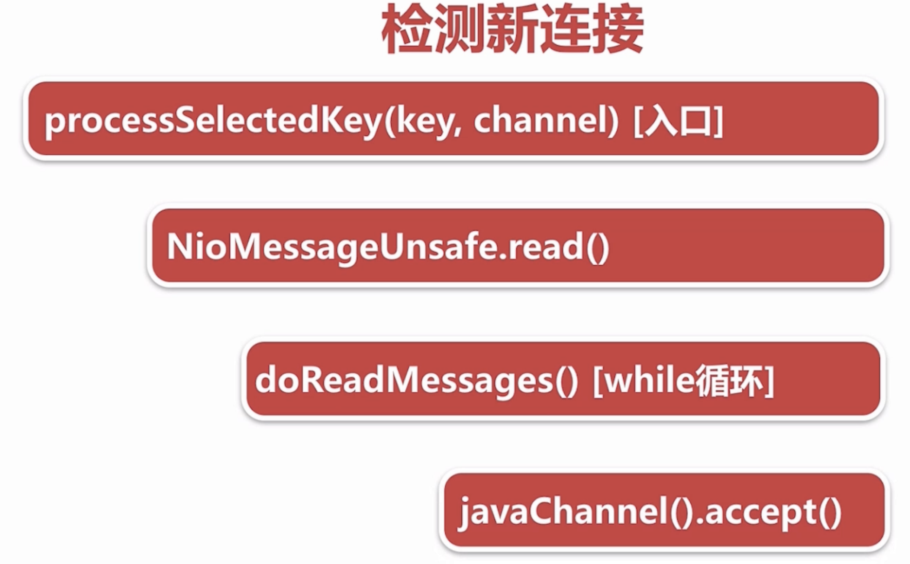
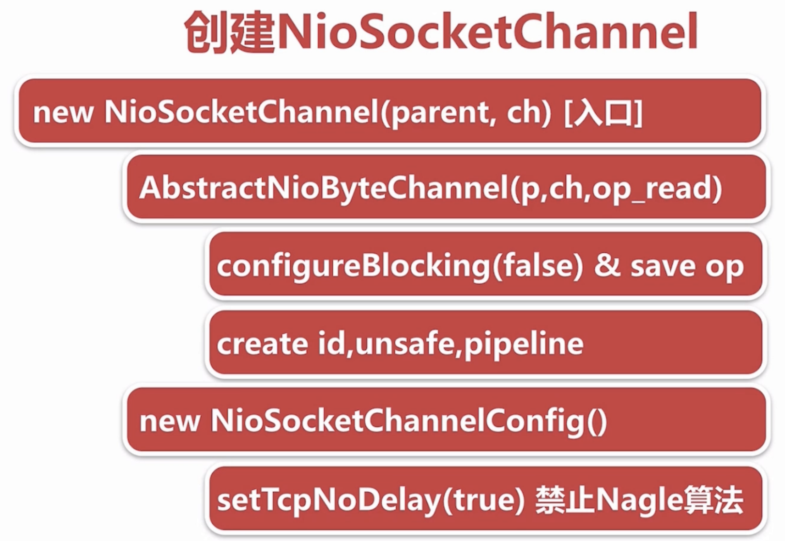
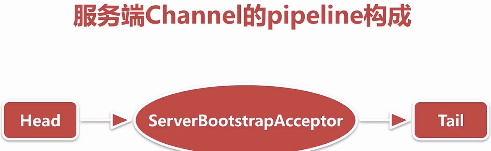

# Netty源码分析（四）：新连接接入

## 1. 相关代码

```java
private void processSelectedKey(SelectionKey k, AbstractNioChannel ch) {
    final AbstractNioChannel.NioUnsafe unsafe = ch.unsafe();
    if (!k.isValid()) {
        final EventLoop eventLoop;
        try {
            eventLoop = ch.eventLoop();
        } catch (Throwable ignored) {
            // If the channel implementation throws an exception because there is no event loop, we ignore this
            // because we are only trying to determine if ch is registered to this event loop and thus has authority
            // to close ch.
            return;
        }
        // Only close ch if ch is still registerd to this EventLoop. ch could have deregistered from the event loop
        // and thus the SelectionKey could be cancelled as part of the deregistration process, but the channel is
        // still healthy and should not be closed.
        // See https://github.com/netty/netty/issues/5125
        if (eventLoop != this || eventLoop == null) {
            return;
        }
        // close the channel if the key is not valid anymore
        unsafe.close(unsafe.voidPromise());
        return;
    }

    try {
        int readyOps = k.readyOps();
        // We first need to call finishConnect() before try to trigger a read(...) or write(...) as otherwise
        // the NIO JDK channel implementation may throw a NotYetConnectedException.
        if ((readyOps & SelectionKey.OP_CONNECT) != 0) {
            // remove OP_CONNECT as otherwise Selector.select(..) will always return without blocking
            // See https://github.com/netty/netty/issues/924
            int ops = k.interestOps();
            ops &= ~SelectionKey.OP_CONNECT;
            k.interestOps(ops);

            unsafe.finishConnect();
        }

        // Process OP_WRITE first as we may be able to write some queued buffers and so free memory.
        if ((readyOps & SelectionKey.OP_WRITE) != 0) {
            // Call forceFlush which will also take care of clear the OP_WRITE once there is nothing left to write
            ch.unsafe().forceFlush();
        }

        // Also check for readOps of 0 to workaround possible JDK bug which may otherwise lead
        // to a spin loop
        if ((readyOps & (SelectionKey.OP_READ | SelectionKey.OP_ACCEPT)) != 0 || readyOps == 0) {
            unsafe.read();
            if (!ch.isOpen()) {
                // Connection already closed - no need to handle write.
                return;
            }
        }
    } catch (CancelledKeyException ignored) {
        unsafe.close(unsafe.voidPromise());
    }
}
```

## 2. 两个问题

1.  什么时候接入新连接
2.  什么时候开始注册读事件

## 3. 新连接接入流程

新连接接入主要分为四步： 

1.  检测新连接 
2.  创建NioEventLoop 
3.  分配线程记注册Selector 
4.  向Selector注册读事件

### 3.1. 检测新连接



首先，我们监听Accept事件，监听到后会调用`unsafe.read()`，我们点进去查看：

```java
public void read() {
    assert eventLoop().inEventLoop();
    final ChannelConfig config = config();
    final ChannelPipeline pipeline = pipeline();
    final RecvByteBufAllocator.Handle allocHandle = unsafe().recvBufAllocHandle();
    allocHandle.reset(config);

    boolean closed = false;
    Throwable exception = null;
    try {
        try {
            // 检测Accept事件并打开socket
            do {
                int localRead = doReadMessages(readBuf);
                if (localRead == 0) {
                    break;
                }
                if (localRead < 0) {
                    closed = true;
                    break;
                }

                allocHandle.incMessagesRead(localRead);
            } while (allocHandle.continueReading());
        } catch (Throwable t) {
            exception = t;
        }

        int size = readBuf.size();
        for (int i = 0; i < size; i ++) {
            readPending = false;
            pipeline.fireChannelRead(readBuf.get(i));
        }
        readBuf.clear();
        allocHandle.readComplete();
        pipeline.fireChannelReadComplete();

        if (exception != null) {
            closed = closeOnReadError(exception);

            pipeline.fireExceptionCaught(exception);
        }

        if (closed) {
            inputShutdown = true;
            if (isOpen()) {
                close(voidPromise());
            }
        }
    } finally {
        // Check if there is a readPending which was not processed yet.
        // This could be for two reasons:
        // * The user called Channel.read() or ChannelHandlerContext.read() in channelRead(...) method
        // * The user called Channel.read() or ChannelHandlerContext.read() in channelReadComplete(...) method
        //
        // See https://github.com/netty/netty/issues/2254
        if (!readPending && !config.isAutoRead()) {
            removeReadOp();
        }
    }
}
```

* `allocHandle`用于控制每一个channel的buf区域，例如`maxMessagePerRead`等。
* 可以看到有一个`do while`的循环，通过这个循环Netty会检测到新的连接并且打开socket。

点进去查看`doReadMessages(readBuf)`方法：

```java
protected int doReadMessages(List<Object> buf) throws Exception {
    SocketChannel ch = javaChannel().accept();

    try {
        if (ch != null) {
            buf.add(new NioSocketChannel(this, ch));
            return 1;
        }
    } catch (Throwable t) {
        logger.warn("Failed to create a new channel from an accepted socket.", t);

        try {
            ch.close();
        } catch (Throwable t2) {
            logger.warn("Failed to close a socket.", t2);
        }
    }

    return 0;
}
```

首先获得一个JDK底层的Channel，接着将其封装成`NioSocketChannel`，并且添加到buf中。buf是由`unsafe`调用该方法时传进来的参数，用于存放连接：

```java
private final List<Object> readBuf = new ArrayList<Object>();
```

* 添加成功后，会返回1，表示增加一条新连接，而-1则表示关闭一条连接，0表示打开新连接失败。
* 之后回到`unsafe.read()`方法，继续往下会运行`allocHandle.incMessagesRead(localRead)`方法进行记录。

```java
public final void incMessagesRead(int amt) {
    totalMessages += amt;
}
```

* 通过allocHandle.continueReading\(\)判断是否继续循环。

查看`allocHandle.continueReading()`代码：

```java
public boolean continueReading() {
    return config.isAutoRead() &&
           attemptedBytesRead == lastBytesRead &&
           totalMessages < maxMessagePerRead &&
           totalBytesRead < Integer.MAX_VALUE;
}
```

### 3.2. 创建NioSocketChannel

第二部分是在`doReadMessages`方法中创建`NioSocketChannel`，并且添加到`readBuf`中。 



```java
new NioSocketChannel(this, ch);
```

其中`parent`参数为`this`（Channel类型为`NioServerSocketChannel`），指的是服务端的Channel，而`ch`指的是刚刚打开的JDK的客户端Channel。 继续跟进：

```java
public NioSocketChannel(Channel parent, SocketChannel socket) {
    super(parent, socket);
    config = new NioSocketChannelConfig(this, socket.socket());
}
```

其中`super(parent, socket);`继续调用父类构造函数。`config = new NioSocketChannelConfig(this, socket.socket());`进行`Socket`的配置。 继续看父类构造函数：

```java
protected AbstractNioByteChannel(Channel parent, SelectableChannel ch) {
    super(parent, ch, SelectionKey.OP_READ);
}
```

可以看到多了一个`SelectionKey.OP_READ`参数，表示该Channel对读事件感兴趣。继续：

```java
protected AbstractNioChannel(Channel parent, SelectableChannel ch, int readInterestOp) {
    super(parent);
    this.ch = ch;
    this.readInterestOp = readInterestOp;
    try {
        ch.configureBlocking(false);
    } catch (IOException e) {
        try {
            ch.close();
        } catch (IOException e2) {
            if (logger.isWarnEnabled()) {
                logger.warn(
                        "Failed to close a partially initialized socket.", e2);
            }
        }

        throw new ChannelException("Failed to enter non-blocking mode.", e);
    }
}
```

继续查看`super(parent);`：

```java
protected AbstractChannel(Channel parent) {
    this.parent = parent;
    id = newId();
    unsafe = newUnsafe();
    pipeline = newChannelPipeline();
}
```

创建了一些Channel的基本组件。 接下来看`new NioSocketChannelConfig(this, socket.socket());`：

```java
private NioSocketChannelConfig(NioSocketChannel channel, Socket javaSocket) {
    super(channel, javaSocket);
}
```

继续：

```java
public DefaultSocketChannelConfig(SocketChannel channel, Socket javaSocket) {
    super(channel);
    if (javaSocket == null) {
        throw new NullPointerException("javaSocket");
    }
    this.javaSocket = javaSocket;

    // Enable TCP_NODELAY by default if possible.
    if (PlatformDependent.canEnableTcpNoDelayByDefault()) {
        try {
            setTcpNoDelay(true);
        } catch (Exception e) {
            // Ignore.
        }
    }
}
```

* 保存底层的`socket`
* 设置`TcpNoDelay`

跟进`setTcpNoDelay(true);`：

```java
public void setTcpNoDelay(boolean on) throws SocketException {
  if (isClosed())
      throw new SocketException("Socket is closed");
  getImpl().setOption(SocketOptions.TCP_NODELAY, Boolean.valueOf(on));
}
```

这里就调用了JDK的底层方法了。

### **3.3 分配线程记注册Selector**

回到`read()`方法，继续往下看：

```java
int size = readBuf.size();
for (int i = 0; i < size; i ++) {
  readPending = false;
  pipeline.fireChannelRead(readBuf.get(i));
}
readBuf.clear();
```

首先是获得目前建立的Socket连接`readBuf`，并对其中的每一个Channel进行`fireChannelRead`操作。 



如图，`channelRead`事件会从head传到Acceptor再传到tail上。 跟着`fireChannelRead`方法，点进去：

```java
public final ChannelPipeline fireChannelRead(Object msg) {
    AbstractChannelHandlerContext.invokeChannelRead(head, msg);
    return this;
}
```

继续：

```java
static void invokeChannelRead(final AbstractChannelHandlerContext next, Object msg) {
    final Object m = next.pipeline.touch(ObjectUtil.checkNotNull(msg, "msg"), next);
    EventExecutor executor = next.executor();
    if (executor.inEventLoop()) {
        next.invokeChannelRead(m);
    } else {
        executor.execute(new Runnable() {
            @Override
            public void run() {
                next.invokeChannelRead(m);
            }
        });
    }
}
```

继续：

```java
private void invokeChannelRead(Object msg) {
    if (invokeHandler()) {
        try {
            ((ChannelInboundHandler) handler()).channelRead(this, msg);
        } catch (Throwable t) {
            notifyHandlerException(t);
        }
    } else {
        fireChannelRead(msg);
    }
}
```

可以看到，这里调用了head的`channelRead`方法：

```java
public void channelRead(ChannelHandlerContext ctx, Object msg) throws Exception {
    ctx.fireChannelRead(msg);
}
```

head的`invokeChannelRead`会将事件传播到下一个Handler，即Acceptor，看一下Acceptor的`channelRead`：

```java
public void channelRead(ChannelHandlerContext ctx, Object msg) {
    final Channel child = (Channel) msg;

    // 为客户端Channel添加child Handler
    child.pipeline().addLast(childHandler);

    // 添加options
    for (Entry<ChannelOption<?>, Object> e: childOptions) {
        try {
            if (!child.config().setOption((ChannelOption<Object>) e.getKey(), e.getValue())) {
                logger.warn("Unknown channel option: " + e);
            }
        } catch (Throwable t) {
            logger.warn("Failed to set a channel option: " + child, t);
        }
    }

    // 添加attrs
    for (Entry<AttributeKey<?>, Object> e: childAttrs) {
        child.attr((AttributeKey<Object>) e.getKey()).set(e.getValue());
    }

    //  选择NioEventLoop并且注册Selector
    try {
        childGroup.register(child).addListener(new ChannelFutureListener() {
            @Override
            public void operationComplete(ChannelFuture future) throws Exception {
                if (!future.isSuccess()) {
                    forceClose(child, future.cause());
                }
            }
        });
    } catch (Throwable t) {
        forceClose(child, t);
    }
}
```

这里主要有三部分内容：

* 添加`Child Handler`
* 设置`options`和`sttrs`
* 选择`NioEventLoop`并且注册`Selector`

### 3.4. 向Selector注册读事件

最后一个步骤是注册读事件。进入`register(child)`方法：

```java
public ChannelFuture register(Channel channel) {
    return next().register(channel);
}
```

这里的`next()`返回`NioEventLoopGroup`中的一个`NioEventLoop`。继续查看`register()`方法：

```java
@Override
public ChannelFuture register(Channel channel) {
    return register(new DefaultChannelPromise(channel, this));
}

@Override
public ChannelFuture register(final ChannelPromise promise) {
    ObjectUtil.checkNotNull(promise, "promise");
    promise.channel().unsafe().register(this, promise);
    return promise;
}
```

这里继续查看`unsafe()`的`register`方法，这里的unsafe是客户端channel的unsafe。继续查看方法：

```java
public final void register(EventLoop eventLoop, final ChannelPromise promise) {
    if (eventLoop == null) {
        throw new NullPointerException("eventLoop");
    }
    if (isRegistered()) {
        promise.setFailure(new IllegalStateException("registered to an event loop already"));
        return;
    }
    if (!isCompatible(eventLoop)) {
        promise.setFailure(
                new IllegalStateException("incompatible event loop type: " + eventLoop.getClass().getName()));
        return;
    }

    AbstractChannel.this.eventLoop = eventLoop;

    if (eventLoop.inEventLoop()) {
        register0(promise);
    } else {
        try {
            eventLoop.execute(new Runnable() {
                @Override
                public void run() {
                    register0(promise);
                }
            });
        } catch (Throwable t) {
            logger.warn(
                    "Force-closing a channel whose registration task was not accepted by an event loop: {}",
                    AbstractChannel.this, t);
            closeForcibly();
            closeFuture.setClosed();
            safeSetFailure(promise, t);
        }
    }
}
```

将eventLoop赋值给channel的eventLoop变量。接下来执行`register0(promise)`，继续查看：

```java
private void register0(ChannelPromise promise) {
    try {
        // check if the channel is still open as it could be closed in the mean time when the register
        // call was outside of the eventLoop
        if (!promise.setUncancellable() || !ensureOpen(promise)) {
            return;
        }
        boolean firstRegistration = neverRegistered;
        doRegister();
        neverRegistered = false;
        registered = true;

        // Ensure we call handlerAdded(...) before we actually notify the promise. This is needed as the
        // user may already fire events through the pipeline in the ChannelFutureListener.
        pipeline.invokeHandlerAddedIfNeeded();

        safeSetSuccess(promise);
        pipeline.fireChannelRegistered();
        // Only fire a channelActive if the channel has never been registered. This prevents firing
        // multiple channel actives if the channel is deregistered and re-registered.
        if (isActive()) {
            if (firstRegistration) {
                pipeline.fireChannelActive();
            } else if (config().isAutoRead()) {
                // This channel was registered before and autoRead() is set. This means we need to begin read
                // again so that we process inbound data.
                //
                // See https://github.com/netty/netty/issues/4805
                beginRead();
            }
        }
    } catch (Throwable t) {
        // Close the channel directly to avoid FD leak.
        closeForcibly();
        closeFuture.setClosed();
        safeSetFailure(promise, t);
    }
}
```

查看`doRegister()`方法：

```java
protected void doRegister() throws Exception {
    boolean selected = false;
    for (;;) {
        try {
            selectionKey = javaChannel().register(eventLoop().selector, 0, this);
            return;
        } catch (CancelledKeyException e) {
            if (!selected) {
                // Force the Selector to select now as the "canceled" SelectionKey may still be
                // cached and not removed because no Select.select(..) operation was called yet.
                eventLoop().selectNow();
                selected = true;
            } else {
                // We forced a select operation on the selector before but the SelectionKey is still cached
                // for whatever reason. JDK bug ?
                throw e;
            }
        }
    }
}
```

将JDK底层的channel注册到EventLoop的selector上，感兴趣事件为0，表示任何事件不感兴趣。接下来回到`register0`，继续往下，到达`pipeline.fireChannelActive()`：

```java
public final ChannelPipeline fireChannelActive() {
    AbstractChannelHandlerContext.invokeChannelActive(head);
    return this;
}
```

从head开始传播`active`事件，查看head节点的`channelActive`方法：

```java
public void channelActive(ChannelHandlerContext ctx) throws Exception {
    ctx.fireChannelActive();

    readIfIsAutoRead();
}
```

先是继续传播事件，之后执行`readIfIsAutoRead()`：

```java
private void readIfIsAutoRead() {
    if (channel.config().isAutoRead()) {
        channel.read();
    }
}
```

继续查看`read`：

```java
public Channel read() {
    pipeline.read();
    return this;
}
```

继续：

```java
public final ChannelPipeline read() {
    tail.read();
    return this;
}
```

从tail开始执行`read`：

```java
public ChannelHandlerContext read() {
    final AbstractChannelHandlerContext next = findContextOutbound();
    EventExecutor executor = next.executor();
    if (executor.inEventLoop()) {
        next.invokeRead();
    } else {
        Runnable task = next.invokeReadTask;
        if (task == null) {
            next.invokeReadTask = task = new Runnable() {
                @Override
                public void run() {
                    next.invokeRead();
                }
            };
        }
        executor.execute(task);
    }

    return this;
}
```

next执行`invokeRead()`：

```java
private void invokeRead() {
    if (invokeHandler()) {
        try {
            ((ChannelOutboundHandler) handler()).read(this);
        } catch (Throwable t) {
            notifyHandlerException(t);
        }
    } else {
        read();
    }
}
```

这里的read方法会继续向head方向依次执行，一直到head的read方法：

```java
public void read(ChannelHandlerContext ctx) {
    unsafe.beginRead();
}
```

继续查看：

```java
public final void beginRead() {
    assertEventLoop();

    if (!isActive()) {
        return;
    }

    try {
        doBeginRead();
    } catch (final Exception e) {
        invokeLater(new Runnable() {
            @Override
            public void run() {
                pipeline.fireExceptionCaught(e);
            }
        });
        close(voidPromise());
    }
}
```

查看`doBeginRead()`：

```java
protected void doBeginRead() throws Exception {
    // Channel.read() or ChannelHandlerContext.read() was called
    final SelectionKey selectionKey = this.selectionKey;
    if (!selectionKey.isValid()) {
        return;
    }

    readPending = true;

    final int interestOps = selectionKey.interestOps();
    if ((interestOps & readInterestOp) == 0) {
        selectionKey.interestOps(interestOps | readInterestOp);
    }
}
```

这里的`readInterestOp`就是在创建`NioSocketChannel`时传进来的参数。至此，已经为channel注册了读事件。

